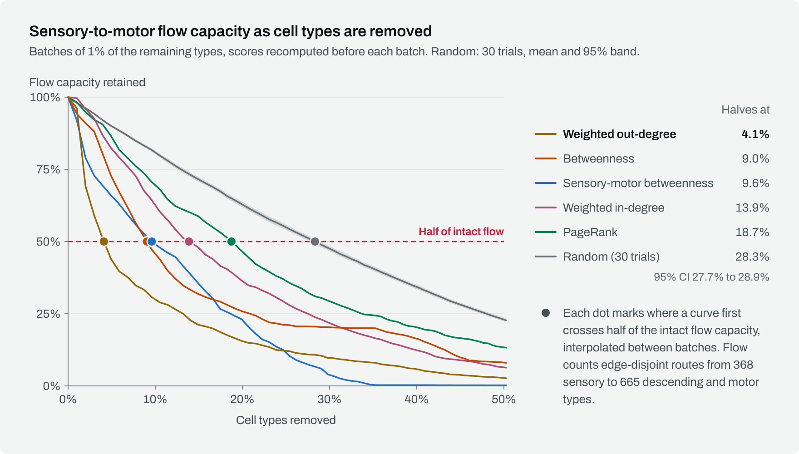
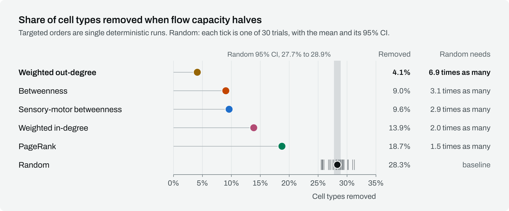
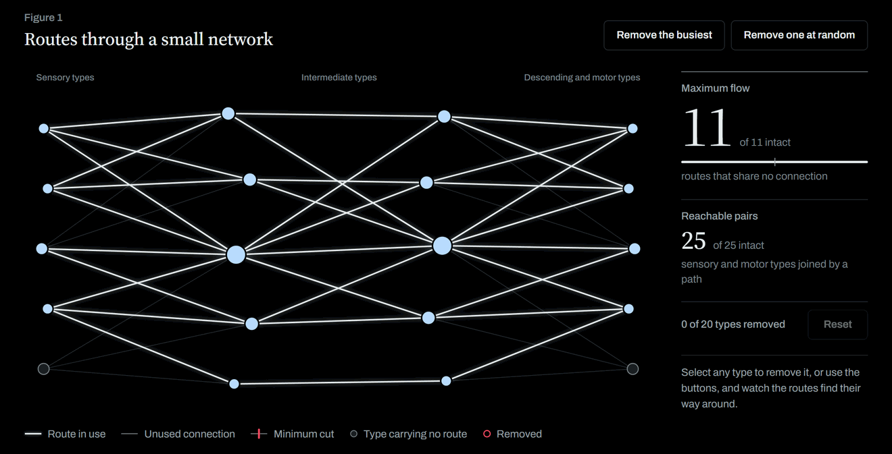
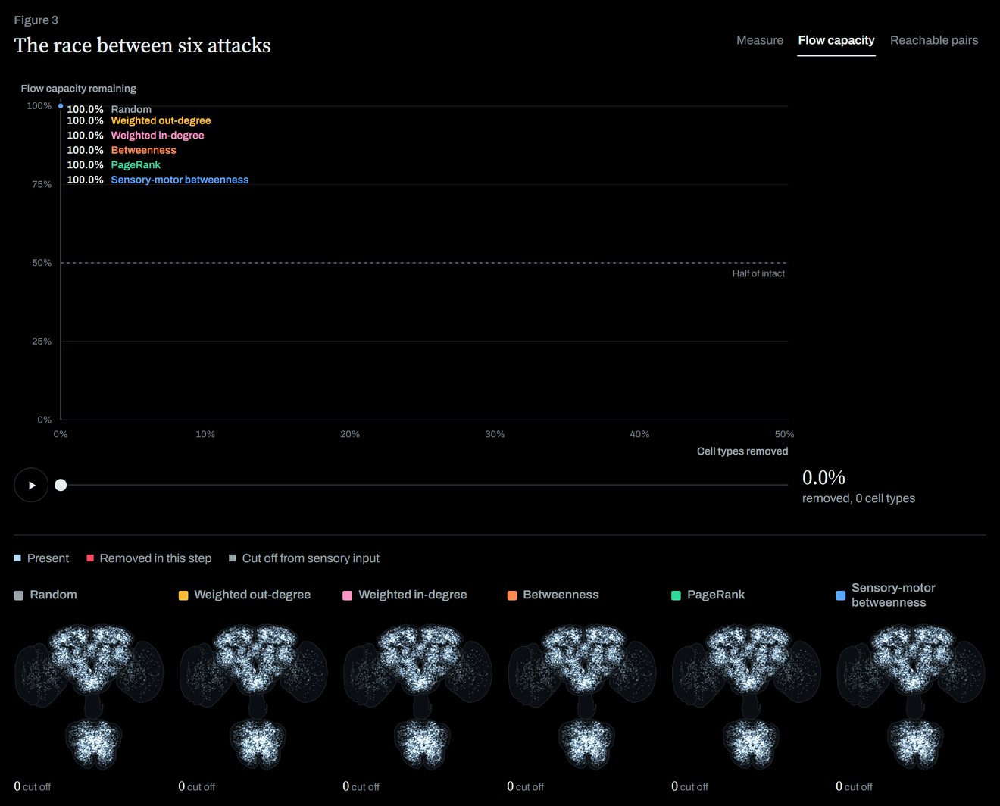
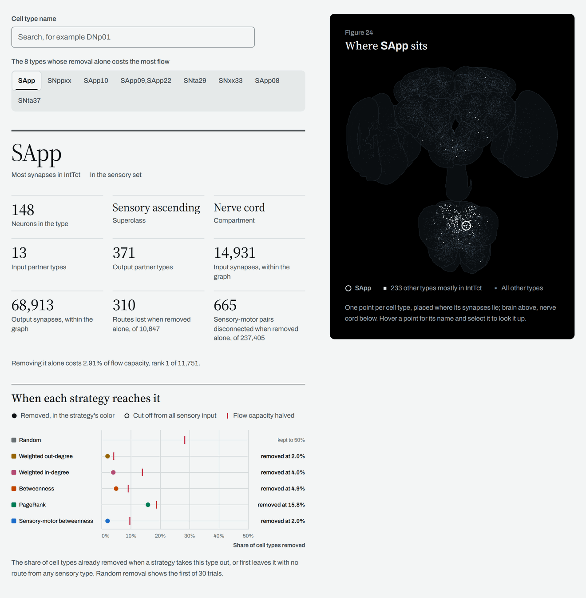
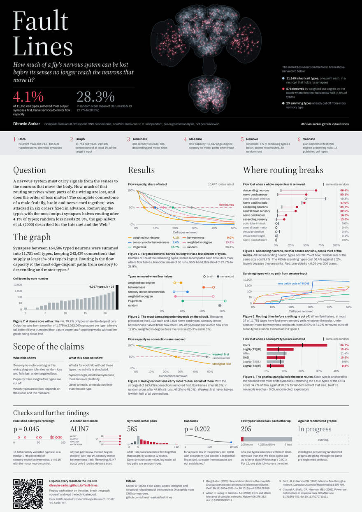

<h1 align="center"><a href="https://dhruvin-sarkar.github.io/fault-lines/"></a></h1>

<p align="center"><b>Very little, if the right parts go first.</b> Removing cell types of the male fruit fly's central nervous system in order of their output synapses halves the number of independent routes from sensory to descending and motor cell types after 4.1% of the 11,751 types are gone. Removing them at random takes 28.3% (95% CI 27.7% to 28.9%). Routes thin out long before anything disconnects, and the order that does the most damage differs between the brain and the nerve cord.<br><sub>Dhruvin Sarkar. An independent, pre-registered analysis of public connectome data, not peer reviewed.</sub></p>

<p align="center"><a href="https://dhruvin-sarkar.github.io/fault-lines/">Illustrated&nbsp;findings</a>&emsp;<a href="https://dhruvin-sarkar.github.io/fault-lines/#collapse">Six&nbsp;attacks</a>&emsp;<a href="https://dhruvin-sarkar.github.io/fault-lines/#lookup">Any&nbsp;cell&nbsp;type</a>&emsp;<a href="paper/report.pdf">Technical&nbsp;report</a>&emsp;<a href="results/preregistration.md">Pre-registration</a>&emsp;<a href="#the-poster">Poster</a></p>

## Abstract

HHMI Janelia and Google Research have released a complete wiring diagram of an adult male fruit fly's central nervous system, brain and nerve cord together.[^berg] A whole nervous system contains both ends of behavior: the sensory neurons that bring information in and the descending and motor neurons that carry commands out. We asked how much of it has to be removed before sensory input can no longer be routed to motor output, and whether the order of removal matters. Degree-based percolation has been applied to the FlyWire whole-brain connectome, tracking its largest connected components;[^lin] here brain and nerve cord are taken together, the measure is directed routing from sensory input to motor output, and a degree-preserving null model is pre-registered. The connectome was reduced to a directed graph of 11,751 cell types and 243,439 connections, and routing was measured as the maximum number of edge-disjoint paths from 368 sensory types to 665 descending and motor types, 10,647 in the intact graph. Six removal orders were fixed in advance and applied in adaptive batches.[^albert] Targeted removal is far more damaging than random removal: by output synapses, routing capacity halves after 4.1% of types, against 28.3% at random. The first halving is a thinning of parallel routes, not a loss of connection; disconnection comes later and, under sensory-motor betweenness, almost all at once. The degree-preserving null model that tests whether the real wiring is more fragile than chance is still computing.

## Results

<p><picture><source media="(prefers-color-scheme: dark)" srcset="assets/readme/stat-plate-dark.svg"></picture></p>

> [!IMPORTANT]
> These are structural results on a static, type-aggregated wiring diagram. Removing a cell type from a graph is not the same as silencing it in a fly: the graph carries no synaptic sign, no electrical synapses and no dynamics, and nothing here simulates neural activity.

**Pre-specified checks**

- [x] Every targeted order degrades flow capacity and reachability faster than random removal (10 of 10 comparisons)
- [x] Every targeted critical fraction lies below the lower bound of the random-removal 95% CI
- [x] Fourteen behaviorally validated cell types rank above other types in sensory-motor betweenness (one-sided p = 0.045; p = 0.10 with the positive control MN9)
- [x] For 205 of 4,449 informative bilateral types, removing both sides costs more than the sum of each side (one-sided p = 5.2 × 10⁻³⁷); 4,235 are exactly additive
- [ ] Structural cascades follow a power law (not established: plausible in the primary pooling, p = 0.202, rejected in the sensitivity pooling, p = 0.036; see [avalanches](#further-results))
- [ ] The real graph is more fragile than 200 degree-preserving randomized graphs (still computing; see [the null model](#the-null-model))

<details>
<summary>All headline values</summary>

| | value |
|---|---|
| cell types / connections | 11,751 / 243,439 |
| sensory / descending and motor types | 368 / 665 |
| intact flow capacity / connected sensory-motor pairs | 10,647 / 237,405 of 244,720 |
| flow halves, weighted out-degree | 4.1% of types removed |
| flow halves, random (30 trials) | 28.3% (95% CI 27.7% to 28.9%) |
| types cut off at any half-flow point | at most 37 |
| types cut off at 50.25% removed, sensory-motor betweenness / first random trial | 5,306 / 1 of 5,846 survivors |
| largest single cascade | 6,046 types |
| flow halves, strongest connections first / random connections | 26.8% / 47.6% of connections |
| curated behavioral types, sensory-motor betweenness | one-sided p = 0.045, AUC 0.630 |

<sub>Source: <a href="results/fragility_scores.json">results/fragility_scores.json</a>, <a href="results/critical_thresholds.json">results/critical_thresholds.json</a>, <a href="results/type_atlas.json">results/type_atlas.json</a>, <a href="results/edge_attack.json">results/edge_attack.json</a>, <a href="results/literature_validation.json">results/literature_validation.json</a></sub>

</details>

<p><a href="https://dhruvin-sarkar.github.io/fault-lines/#collapse"><picture><source media="(prefers-color-scheme: dark)" srcset="assets/readme/fig-curves-dark.svg"></picture></a></p>

**Figure 1. Every targeted order collapses routing long before random removal does.** Cell types are removed in batches of 1% of those remaining, and each targeted score is recomputed on the reduced graph before the next batch, which is usually more damaging than a ranking fixed on the intact graph (Holme et al. 2002).[^holme] Flow capacity counts edge-disjoint routes from the sensory to the descending and motor types; by max-flow min-cut duality it is also the smallest number of connections whose loss would separate them.[^ford] Removing the types with the most output synapses first is the most damaging order: after 2.99% of types are gone, 59% of flow capacity is left. At 50.25% removed, random removal still keeps 22.7% of flow on average over 30 trials.

<details>
<summary>Values behind Figure 1</summary>

The fragility score is the area under the normalized curve over the first 50% of removals, divided by that range: 1 for a curve that never drops, 0 for one that falls to zero at once.[^schneider]

| order | AUC, flow | AUC, reachability | flow halves at (interpolated) | first batch below half |
|---|---:|---:|---:|---:|
| weighted out-degree | 0.197 | 0.349 | 4.11% | 4.92% |
| sensory-motor betweenness | 0.233 | 0.256 | 9.61% | 10.51% |
| betweenness | 0.315 | 0.267 | 9.04% | 9.60% |
| weighted in-degree | 0.370 | 0.484 | 13.87% | 14.07% |
| PageRank | 0.441 | 0.461 | 18.75% | 19.10% |
| random, 30 trials (95% CI) | 0.570 (0.564 to 0.576) | 0.586 (0.581 to 0.591) | 28.32% (27.74% to 28.90%) | 28.70% (28.11% to 29.29%) |

The two metrics rank the orders differently. Weighted out-degree removes capacity fastest, while the betweenness orders disconnect sensory-motor pairs fastest, because they remove relays through which many pairs communicate.

<sub>Source: <a href="results/fragility_scores.json">results/fragility_scores.json</a>, <a href="results/critical_thresholds.md">results/critical_thresholds.md</a>, <a href="results/percolation_curves.csv">results/percolation_curves.csv</a></sub>

</details>

## How early routing fails

<p><a href="https://dhruvin-sarkar.github.io/fault-lines/#thresholds"><picture><source media="(prefers-color-scheme: dark)" srcset="assets/readme/fig-thresholds-dark.svg"></picture></a></p>

**Figure 2. Random removal needs 6.9 times as many cell types as removal by output synapses.** The critical fraction is the share of types removed when flow capacity first falls below half of its intact value, interpolated between the last batch above half and the first below it. The same cutoff applies to every order. Across the 30 random trials it ranges from 25.5% to 31.3%, and every targeted value lies well below that range. A gap of this size between random and targeted removal resembles the pattern described for networks with heavy-tailed connectivity.[^albert] Here the out-degree and out-strength tails are heavy, but a lognormal or truncated power law describes them better than a pure power law.[^clauset]

**Capacity thins before anything disconnects.** At each order's own half-flow batch, at most 37 surviving types have lost every directed path from sensory input. Disconnection comes later and differs sharply between orders. Under sensory-motor betweenness no surviving type is cut off up to 10.5% removed and only 18 by 20.7%; then a single batch, from 30.5% to 31.2% removed, cuts off 6,046 types at once, when flow capacity has already fallen to 3.3% of intact. Measures based on the largest connected component, which dominate the attack-tolerance literature, would register little of the first phase.

<details>
<summary>Disconnection across the type population</summary>

Surviving cell types with no directed path from any surviving sensory type, replaying each order (targeted runs and random trial 0):

| order | at its own half-flow batch (removed) | at 50.25% removed, of 5,846 survivors |
|---|---:|---:|
| weighted out-degree | 23 (4.92%) | 662 |
| weighted in-degree | 37 (14.07%) | 257 |
| betweenness | 2 (9.60%) | 520 |
| PageRank | 4 (19.10%) | 35 |
| sensory-motor betweenness | 0 (10.51%) | 5,306 |
| random, trial 0 | 0 (28.36%) | 1 |

<sub>Source: <a href="results/type_atlas.json">results/type_atlas.json</a> (replay), <a href="results/percolation_curves.csv">results/percolation_curves.csv</a>, <a href="results/avalanche_analysis.md">results/avalanche_analysis.md</a></sub>

</details>

## Where the routing runs

<p><a href="https://dhruvin-sarkar.github.io/fault-lines/#regions"><picture><source media="(prefers-color-scheme: dark)" srcset="assets/readme/fig-regions-dark.svg"></picture></a></p>

**Figure 3. The gnathal ganglia carry the most routing of any neuropil.** Each cell type is anchored to the neuropil holding most of its synapses, and all types anchored in one neuropil are removed together, against 200 random sets of the same size. Removing the 1,237 types anchored in the gnathal ganglia (GNG) costs 34.7% of flow capacity, against 20.6% for random sets. Neuropils that hold many sensory or motor types (the GNG, the leg neuromeres, the saddle, the antennal lobes) lead, as expected when removal deletes sources and sinks, and several mushroom body lobes lose no flow at all. This analysis is exploratory: with 200 draws the smallest attainable p is 1/201, and no neuropil can pass a Bonferroni correction across 91 tests.

<details>
<summary>Values behind Figure 3</summary>

| neuropil | types | sensory | descending or motor | flow lost | same-size random | p |
|---|---:|---:|---:|---:|---:|---:|
| GNG | 1,237 | 79 | 294 | 34.7% | 20.6% | 0.005 |
| LegNp(T3)(R) | 389 | 27 | 10 | 15.4% | 6.7% | 0.005 |
| ANm | 584 | 28 | 77 | 11.4% | 10.0% | 0.214 |
| SAD | 319 | 34 | 33 | 10.6% | 5.5% | 0.005 |
| LegNp(T2)(L) | 456 | 7 | 10 | 9.9% | 7.8% | 0.070 |
| LegNp(T2)(R) | 131 | 16 | 8 | 9.8% | 2.2% | 0.005 |
| Ov(L) | 115 | 24 | 1 | 9.2% | 2.0% | 0.005 |
| AL(R) | 226 | 50 | 1 | 8.9% | 3.8% | 0.005 |
| LegNp(T3)(L) | 366 | 11 | 8 | 7.8% | 6.3% | 0.129 |
| IntTct | 234 | 8 | 11 | 7.6% | 4.1% | 0.015 |

All 91 neuropils are in [results/regional_impact.csv](results/regional_impact.csv), which GitHub shows as a searchable table.

<sub>Source: <a href="results/regional_impact.md">results/regional_impact.md</a></sub>

</details>

## Which classes carry it

<p><a href="https://dhruvin-sarkar.github.io/fault-lines/#classes"><picture><source media="(prefers-color-scheme: dark)" srcset="assets/readme/fig-classes-dark.svg"></picture></a></p>

**Figure 4. Ascending neurons carry far more routing than their number predicts.** For the 13 superclasses with at least 20 types, every type of the class is removed at once. Classes that contain the sensory or motor terminals lose far more than random sets of the same size, which largely restates that they hold the sources and sinks. The informative rows are the others. The 563 ascending neuron types, which are neither sources nor sinks, cost 34.7% of flow against 9.7% for random sets (p = 0.005), consistent with ascending pathways from the nerve cord to the brain carrying a large share of the routes. The 6,605 central brain intrinsic types cost less than random sets of the same size (49.3% against 82.4%), and the optic lobe and visual classes each cost less than 1%, partly because the eleven visual sensory types contribute few sources however many neurons they contain.

<details>
<summary>Values behind Figure 4</summary>

| superclass | types | neurons | flow lost | same-size random | p |
|---|---:|---:|---:|---:|---:|
| descending | 480 | 1,310 | 66.4% | 8.2% | 0.005 |
| nerve cord sensory | 169 | 5,598 | 50.1% | 2.9% | 0.005 |
| central brain intrinsic | 6,605 | 31,280 | 49.3% | 82.4% | 1.000 |
| nerve cord intrinsic | 2,777 | 12,943 | 47.0% | 42.9% | 0.040 |
| ascending | 563 | 1,865 | 34.7% | 9.7% | 0.005 |
| central brain sensory | 158 | 4,756 | 32.5% | 2.7% | 0.005 |
| nerve cord motor | 142 | 699 | 16.6% | 2.4% | 0.005 |
| sensory ascending | 26 | 536 | 13.6% | 0.4% | 0.005 |
| optic lobe intrinsic | 271 | 89,358 | 0.6% | 4.7% | 1.000 |
| central brain motor | 43 | 106 | 0.4% | 0.7% | 0.776 |
| visual projection | 346 | 9,202 | 0.4% | 5.9% | 1.000 |
| visual centrifugal | 108 | 562 | 0.1% | 1.8% | 1.000 |
| nerve cord efferent | 27 | 78 | 0.0% | 0.4% | 1.000 |

p = (1 + k) / 201, where k is the number of same-size random sets that lose at least as much flow. Exploratory and uncorrected.

<sub>Source: <a href="results/structure_profile.md">results/structure_profile.md</a>, <a href="results/superclass_impact.csv">results/superclass_impact.csv</a></sub>

</details>

## Brain and nerve cord

<p><a href="https://dhruvin-sarkar.github.io/fault-lines/#brain-nerve-cord"><picture><source media="(prefers-color-scheme: dark)" srcset="assets/readme/fig-compartments-dark.svg"></picture></a></p>

**Figure 5. What is critical depends on the circuit.** Each type was assigned to the brain or the nerve cord by where most of its synapses are, and each subgraph received its own sensory and motor sets and the full protocol. Under random removal the two do not differ significantly (Welch t = −1.54, p = 0.13). Under targeted removal they behave differently: sensory-motor betweenness is the most damaging order in the brain (AUC 0.151) and comparatively mild in the nerve cord (0.363), where weighted in-degree (0.228) and PageRank (0.251) lead. In the brain, PageRank removal (0.664) is less damaging than random removal. No direction was hypothesized, the subgraphs differ in size and density, and the targeted runs are single runs, so these describe two graphs rather than estimating an effect.

<details>
<summary>Values behind Figure 5</summary>

| | brain-dominant | nerve cord-dominant |
|---|---:|---:|
| cell types / connections | 8,123 / 157,374 | 3,628 / 66,700 |
| sensory / descending and motor types | 182 / 498 | 186 / 167 |
| intact flow capacity | 3,765 | 3,066 |
| AUC flow, random (95% CI) | 0.572 (0.564 to 0.579) | 0.579 (0.573 to 0.586) |
| AUC flow, weighted out-degree | 0.257 | 0.276 |
| AUC flow, weighted in-degree | 0.504 | 0.228 |
| AUC flow, betweenness | 0.544 | 0.477 |
| AUC flow, PageRank | 0.664 | 0.251 |
| AUC flow, sensory-motor betweenness | 0.151 | 0.363 |
| flow halves, random / weighted out-degree | 28.4% / 6.3% | 28.8% / 9.3% |
| flow halves, weighted in-degree / sensory-motor betweenness | 25.3% / 5.9% | 6.6% / 12.6% |

<sub>Source: <a href="results/brain_vnc_comparison.md">results/brain_vnc_comparison.md</a></sub>

</details>

## Further results

**Synapse count is not routing capacity.** Flow capacity gives every connection one unit, so removing connections by synapse count asks whether the heaviest connections also carry the routes.[^kaiser] Removing the strongest first halves flow after 26.8% of the 243,439 connections; random orders need 47.6% on average (47.2% to 48.0% over 5 orders); removing the weakest first never halves it within 50%. A heavy connection can be redundant, and a thin one can be the only way across ([edge_attack.md](results/edge_attack.md)).

**Single types are almost never indispensable.** Removed alone, the most costly type is the sensory type `SApp` (310 of 10,647 routes). No type outside the sensory and motor sets costs more than 31 (`lLN2T_b`), and only two, `AMMC029` and `ANXXX264`, disconnect any sensory-motor pair ([single_removal_impacts.csv](results/single_removal_impacts.csv)).

**A hidden bottleneck.** Four types rank in the bottom half by degree and by PageRank but in the top 1% by sensory-motor betweenness. The most extreme, `ALIN7`, is a two-neuron central brain type fed by olfactory and mechanosensory neurons that ranks 21st of 11,751. Removing it disconnects no pair and costs 9 routes, but lengthens the shortest route for 849 pairs: concentrating shortest routes is not the same as being indispensable ([hidden_bottleneck.md](results/hidden_bottleneck.md)).

**The two sides rarely back each other up.** In a graph with one node per type and hemisphere, removing both sides of a type costs more than the mean of removing one side (4,449 informative types, one-sided Wilcoxon signed-rank p < 10⁻³²³, below the smallest positive double; log₁₀ p = −728.2 by the normal approximation) and more than the sum of the two single-side removals (p = 5.2 × 10⁻³⁷). 205 types are superadditive, 4,235 additive and 9 subadditive, and for 12 types the other side is complete structural insurance: either side alone can go without any loss. The largest gains are in sensory types (eight of the nine types at +3 routes or more), where the gain reflects substitution at the entry points into shared downstream capacity ([bilateral_symmetry.md](results/bilateral_symmetry.md)).

**Pairs of sensory types share capacity.** Of 31,125 pairs from a pool of 250 high-impact types, 585 lose more together than the sum of their single losses, at most +12 routes (`SNppxx` with `SNta29`), and every such pair is two sensory types. The pool fixed in advance was dominated by sensory types, so it does not reach the interneuron pairs the search was meant to find ([synthetic_lethal_pairs.md](results/synthetic_lethal_pairs.md)).

**Cascades are not established as scale-free.** A discrete power law fitted by maximum likelihood is plausible in the pre-registered pooling (α = 2.011, bootstrap p = 0.202) but rejected when all 30 random trials are pooled (p = 0.036), and a lognormal cannot be distinguished in either ([avalanche_analysis.md](results/avalanche_analysis.md)).

**Agreement with behavioral experiments is modest.** Fourteen cell types with published activation or silencing phenotypes, fixed before scoring, rank above other types in sensory-motor betweenness. The result is close to the threshold and weakens when the positive control is added.

<details>
<summary>Curated cell types and tests</summary>

| type | behavior | sensory-motor betweenness percentile | betweenness percentile |
|---|---|---:|---:|
| `aSP22` | courtship action sequence | 95.9 | 99.6 |
| `LPLC2` | looming-evoked escape | 92.3 | 94.4 |
| `DNp10` | landing | 91.1 | 97.9 |
| `DNp07` | landing | 86.8 | 95.3 |
| `DNa02` | ipsilateral turning | 85.7 | 98.4 |
| `LC4` | looming-evoked escape | 79.8 | 93.7 |
| `DNp01` | escape takeoff | 78.4 | 43.0 |
| `MDN` | backward walking | 75.1 | 98.9 |
| `PFL3` | goal-directed steering | 54.2 | 99.9 |
| `pIP10` | courtship song | 53.1 | 91.4 |
| `DNp09` | object-directed walking | 47.2 | 83.7 |
| `PPL101` | aversive punishment signal | 22.6 | 46.0 |
| `EPG` | menotaxis | 9.8 | 99.1 |
| `MBON11` | aversive memory expression | 9.8 | 22.3 |

| set | score | one-sided p | AUC | median percentile |
|---|---|---:|---:|---:|
| primary (14) | sensory-motor betweenness | 0.045 | 0.630 | 76.8 |
| primary (14) | single-removal flow loss | 0.97 | 0.376 | 32.3 |
| primary (14) | global betweenness | 8.7 × 10⁻⁶ | 0.832 | 94.9 |
| with the positive control `MN9` (15) | sensory-motor betweenness | 0.10 | 0.595 | 75.1 |

Mann-Whitney U tests against all other types. Percentiles are mid-rank, so 9.8 is the shared value of types that score zero.

<sub>Source: <a href="results/literature_validation.md">results/literature_validation.md</a></sub>

</details>

**Against published thresholds.** The 4.1% threshold lies in the range reported for engineered hub-dominated networks under degree or load attack, such as the Internet at about 3% and the North American power grid, which loses up to 60% of connectivity when 4% of substations are removed, and well below the roughly 40% reported for human functional brain networks. The breakdown criteria differ, so this comparison is qualitative ([network_comparison.md](results/network_comparison.md)).

## The null model

> [!NOTE]
> The degree-preserving null model is still computing, and no result from it is reported yet. When it finishes, this section will give the null distributions, z-scores and p-values for all six orders, whatever they show.

The pre-registered hypothesis, restated before any randomized graph was scored, is directional: for each removal order, the real graph's flow-capacity AUC is lower, that is more fragile, than that of degree-preserving randomized graphs under the same order. Each of 200 randomized graphs is the real type graph after 10 × |E| edge swaps that keep every type's in-degree and out-degree,[^maslov] with each type's outgoing synapse counts shuffled onto its new edges so that out-strength is kept too. Every randomized graph receives the full protocol, including 30 random-removal trials, and each order is tested with the one-sided empirical p-value below at a Bonferroni-corrected threshold of 0.05 / 6 = 0.0083. With 200 graphs the smallest attainable p is 1/201 = 0.005. The plan is in [null_model_validation.md](results/null_model_validation.md).

## Where it falls short

- **Structure, not function:** removing a type from the graph is not silencing it in an animal. There is no synaptic sign, no electrical synapse, no neuromodulation and no activity.
- **Cell-type aggregation:** a type of one neuron counts the same as a type of thousands. The eleven visual sensory types hold 6,098 neurons but contribute few sources.
- **The 1% input threshold:** it caps in-degree at 100 partner types and decides which weak routes exist. It was fixed in advance and no alternative was tested.
- **Unit capacities:** flow counts routes, not synapses. A weighted capacity would give different values.
- **Terminal definitions:** the sensory and motor sets follow neuPrint superclass annotations, and removing a region or class that holds terminals deletes sources or sinks by construction.
- **Single runs:** each targeted order is deterministic apart from tie-breaking and was run once.
- **Exploratory analyses:** the full single-type removal table, disconnection across the type population, regional and superclass removal, the structural profile, the edge attack and the published-threshold comparison were added after the pre-registration, and the p-values among them are uncorrected.
- **One animal:** a single male fly, at one annotation release. Individual variability and reconstruction errors are not captured.
- **Review:** none of this has been peer reviewed.

## Explore the site

The live site is an illustrated version of everything above, with every removal order replayable. Each image opens the view it shows.

**[How fragility is measured](https://dhruvin-sarkar.github.io/fault-lines/#measure):** a small network in which you remove types yourself and watch the edge-disjoint routes find their way around.

<p><a href="https://dhruvin-sarkar.github.io/fault-lines/#measure"></a><br><sub>Removing the busiest type, one at a time, from the small network that introduces flow capacity.</sub></p>

**[Six attacks](https://dhruvin-sarkar.github.io/fault-lines/#collapse):** all six removal orders advancing together on maps of the nervous system, one square per cell type, with removed and cut-off types drawn as they go.

<p><a href="https://dhruvin-sarkar.github.io/fault-lines/#collapse"></a><br><sub>The race between the six removal orders, from the intact graph to half of all types removed.</sub></p>

**[Any cell type](https://dhruvin-sarkar.github.io/fault-lines/#lookup):** every one of the 11,751 types, with its place in the body, its scores, what removing it alone costs, and when each order removes it or cuts it off.

<p><a href="https://dhruvin-sarkar.github.io/fault-lines/#lookup/ALIN7"></a><br><sub>Looking up the hidden bottleneck ALIN7.</sub></p>

- **[Findings](https://dhruvin-sarkar.github.io/fault-lines/#findings):** one block per result, each with an interactive figure: thresholds, disconnection, regions, superclasses, connections, brain and nerve cord, avalanches, structure, pairs, bilateral redundancy and the hidden bottleneck.
- **[Methods and limits](https://dhruvin-sarkar.github.io/fault-lines/#methods):** the data, graph construction, sensory and motor sets, measures, removal protocol, validation, limitations and how to reproduce every number.

<p><a href="https://dhruvin-sarkar.github.io/fault-lines/"></a><br><sub>The opening, the key findings, the threshold comparison and a cell type profile at phone width.</sub></p>

## Methods

<p><a href="https://dhruvin-sarkar.github.io/fault-lines/#methods"><picture><source media="(prefers-color-scheme: dark)" srcset="assets/readme/methods-pipeline-dark.svg"></picture></a></p>

1. **Data.** The male CNS connectome, `male-cns:v1.0`, queried through neuPrint.[^plaza] The database holds 176,422 neuron records, of which 164,506 carry one of 11,751 cell types.
2. **Type graph.** Neuron-to-neuron synapse counts are summed into type-to-type counts $w(u \to v)$. An edge is kept when it supplies at least 1% of the target type's input, and self-loops are dropped, which leaves 243,439 directed edges:

   ```math
   \frac{w(u \to v)}{\sum_{u'} w(u' \to v)} \ge 0.01
   ```

3. **Terminals.** The source set $S$ holds the 368 types whose majority superclass is sensory; the sink set $M$ holds the 665 descending neuron and motor types.
4. **Pre-registration.** The hypotheses, tests, test directions and every protocol parameter were committed in `0e72491`, after the graph was built and before any removal was run. The order can be checked in the repository history.
5. **Flow capacity.** A supersource feeds every $s \in S$ and every $m \in M$ drains to a supersink; graph edges get unit capacity. The maximum flow $F(G)$ equals the number of edge-disjoint paths from $S$ to $M$.[^ford] The secondary metric $R(G)$ counts sensory-motor pairs joined by a directed path.
6. **Removal.** Six orders: random, weighted out-degree and in-degree (synapse sums), betweenness, PageRank, and sensory-motor betweenness, which counts only shortest paths from $S$ to $M$. With $N$ = 11,751 types and $n_k$ removed, batch $k$ removes the

   ```math
   b_k = \left\lceil 0.01\,(N - n_k) \right\rceil
   ```

   highest-scoring types, and scores are recomputed before the next batch. Random removal is run 30 times.
7. **Fragility and thresholds.** The fragility score is the trapezoidal area under $F(G_k)/F(G_0)$ over the first 50% of removals, divided by that range.[^schneider] The critical fraction interpolates between the last batch at or above half of intact flow and the first below it:

   ```math
   f_c = x_{i-1} + (x_i - x_{i-1}) \, \frac{F_{i-1} - F_0/2}{F_{i-1} - F_i}
   ```

8. **Null model.** 200 degree-preserving randomized graphs,[^maslov] each given the full protocol. For each order $k$ the one-sided empirical p-value is

   ```math
   p_k = \frac{1 + \#\{\, i : \mathrm{AUC}^{\mathrm{null}}_{i,k} \le \mathrm{AUC}^{\mathrm{real}}_k \,\}}{1 + 200}
   ```

   tested at 0.05 / 6.
9. **Follow-up analyses.** Structural avalanches, fitted by maximum likelihood with a bootstrap goodness-of-fit test,[^clauset] brain and nerve cord subgraphs, synthetic-lethal pairs, bilateral redundancy, the hidden bottleneck and literature validation were pre-registered. The full single-type removal table, disconnection across the type population, regional and superclass removal, the structural profile, the edge attack and the published-threshold comparison were added afterwards and are exploratory.

<details>
<summary>Software</summary>

| package | version |
|---|---|
| Python | 3.12.12 |
| neuprint-python | 0.6.3 |
| igraph | 1.0.0 |
| NumPy / SciPy / pandas | 2.5.3 / 1.18.1 / 3.0.5 |
| powerlaw | 2.0.0 |
| networkx | 3.6.1 |
| pyarrow | 25.0.1 |
| matplotlib | 3.11.2 |
| pandoc / typst | 3.11 / 0.15.1 |

</details>

## The poster

<p align="center"><a href="assets/readme/fault-lines-poster.png"></a></p>
<p align="center">One-page summary, 3508 × 4960 pixels. <a href="assets/readme/fault-lines-poster.png">Open the full-size poster</a></p>

## Data and outputs

Every number on this page comes from a file in this repository. These are the ones worth opening directly, with nothing installed and nothing run.

| file | what it holds |
|---|---|
| [results/preregistration.md](results/preregistration.md) | the analysis plan, committed before any removal |
| [results/percolation_curves.csv](results/percolation_curves.csv) | flow capacity, connected pairs and cascade size after every batch of every run |
| [results/critical_thresholds.json](results/critical_thresholds.json) | the critical fraction of each order, with all 30 random trials |
| [results/single_removal_impacts.csv](results/single_removal_impacts.csv) | what removing each of the 11,751 types alone costs |
| [results/regional_impact.csv](results/regional_impact.csv) | all 91 neuropils against their same-size random sets |
| [results/type_atlas.json](results/type_atlas.json) | neuropil outlines and, for every order, when types are removed or cut off |
| [results/bilateral_symmetry.csv](results/bilateral_symmetry.csv) | left, right and both-side removal for every bilateral type |
| [paper/report.md](paper/report.md) | the technical report, also as [PDF](paper/report.pdf) |

## Reproduce

Requirements: Python 3.12, Node 22, GNU Make, and network access to neuPrint and the public `flyem-male-cns` bucket. The `paper` target also needs pandoc with typst.

```sh
python -m venv .venv && . .venv/bin/activate   # .venv\Scripts\activate on Windows
pip install -r requirements.txt
make reproduce WORKERS=8   # data, analyze, validate, context, hero, export, paper, test and verify
make web                   # web/dist
```

The stages can also be run on their own: `make data` (schema, sensory and motor sets, type graphs), `make analyze` (percolation, thresholds and every follow-up analysis), `make validate` (null model and literature validation), `make context` (published thresholds), `make hero` (regional impact, hero image, type atlas), `make export` (site data), `make paper`, `make poster`, `make test` (unit tests) and `make verify` (checks every committed result against its invariants). `make readme` redraws the figures on this page from `results/`, and `make captures` records the site animations from a running development server and a Chrome started with `--remote-debugging-port=9222`.

Raw neuPrint data are cached under `data/` and are not committed. The public dataset can be queried anonymously; set `NEUPRINT_APPLICATION_CREDENTIALS` to use a token. All randomness is seeded from 20260915, and every percolation run is cached as its own file, so an interrupted run resumes where it stopped.

On an 8-core laptop the 35 percolation runs on the real graph take about twenty minutes. The null model is the slow step: each of its 200 graphs repeats all 35 runs, about 200 times the main analysis. Use `NULLS` to run fewer while testing.

<details open>
<summary>Pipeline modules and outputs</summary>

| step | module | output |
|---|---|---|
| neuPrint schema | `pipeline/schema_discovery.py` | [results/schema.md](results/schema.md) |
| sensory and motor sets | `pipeline/identify_sensory_motor_sets.py` | 368 sensory, 665 descending and motor types: [results/sensory_motor_sets.md](results/sensory_motor_sets.md) |
| type graphs | `pipeline/build_type_graph.py` | 11,751 types, 243,439 edges; hemisphere-resolved graph |
| metrics | `pipeline/connectivity_metrics.py` | flow capacity, reachability, cut-off types |
| removal orders | `pipeline/removal_strategies.py`, `pipeline/run_percolation.py` | [results/percolation_curves.csv](results/percolation_curves.csv), [results/fragility_scores.json](results/fragility_scores.json) |
| thresholds | `pipeline/critical_thresholds.py` | [results/critical_thresholds.md](results/critical_thresholds.md) |
| single removal | `pipeline/single_removal.py` | [results/single_removal_impacts.csv](results/single_removal_impacts.csv) |
| avalanches | `pipeline/avalanche_analysis.py` | [results/avalanche_analysis.md](results/avalanche_analysis.md) |
| brain and nerve cord | `pipeline/brain_vnc_comparison.py` | [results/brain_vnc_comparison.md](results/brain_vnc_comparison.md) |
| synthetic-lethal pairs | `pipeline/synthetic_lethal_pairs.py` | [results/synthetic_lethal_pairs.md](results/synthetic_lethal_pairs.md) |
| bilateral redundancy | `pipeline/bilateral_symmetry.py` | [results/bilateral_symmetry.md](results/bilateral_symmetry.md) |
| hidden bottleneck | `pipeline/hidden_bottleneck.py` | [results/hidden_bottleneck.md](results/hidden_bottleneck.md) |
| structure and superclasses | `pipeline/structure_profile.py` | [results/structure_profile.md](results/structure_profile.md) |
| edge attack | `pipeline/edge_attack.py` | [results/edge_attack.md](results/edge_attack.md) |
| null model | `pipeline/null_model.py` | [results/null_model_validation.md](results/null_model_validation.md) |
| literature validation | `pipeline/literature_validation.py` | [results/literature_validation.md](results/literature_validation.md) |
| published thresholds | `pipeline/network_comparison.py` | [results/network_comparison.md](results/network_comparison.md) |
| regional impact and hero image | `pipeline/regional_impact.py`, `pipeline/render_hero.py` | [results/regional_impact.md](results/regional_impact.md), [assets/hero.png](assets/hero.png) |
| type atlas | `pipeline/type_atlas.py` | [results/type_atlas.json](results/type_atlas.json) |
| README figures | `pipeline/readme_assets.py` | plates, figures and methods diagram as SVG in `assets/readme/` |
| site captures | `pipeline/site_captures.py` | GIFs and the phone strip in `assets/readme/` |
| poster | `pipeline/poster.py` | [assets/readme/fault-lines-poster.png](assets/readme/fault-lines-poster.png) |
| site data | `export/build_static_json.py` | `web/public/data/` |
| site | `web/` (React, Vite) | GitHub Pages via `.github/workflows/pages.yml` |

`verify/` holds one check script per result, and `tests/` holds the unit tests. Both run in continuous integration on every push.

</details>

## Credits and citation

The data are the male adult *Drosophila* CNS connectome from HHMI Janelia FlyEM and Google Research, released under CC-BY 4.0. Please cite the original work:

> Berg S, Beckett IR, Costa M, et al. (2026). Sexual dimorphism in the complete *Drosophila* male central nervous system connectome. *Cell* 189(18):5504-5526.e15. doi:[10.1016/j.cell.2026.08.015](https://doi.org/10.1016/j.cell.2026.08.015)

The data were accessed through [neuPrint](https://neuprint.janelia.org), and neuropil meshes were read from the public `flyem-male-cns` bucket. Citation metadata for this repository is in [CITATION.cff](CITATION.cff), which GitHub's "Cite this repository" button reads.

Code is released under the [MIT License](LICENSE).

### Citing this work

```bibtex
@software{sarkar2026faultlines,
  author = {Sarkar, Dhruvin},
  title  = {Fault Lines: attack tolerance and structural robustness of the complete {Drosophila} male {CNS} connectome},
  year   = {2026},
  url    = {https://github.com/dhruvin-sarkar/fault-lines},
  note   = {Independent analysis of public connectome data, not peer reviewed}
}
```

[^berg]: Berg S, Beckett IR, Costa M, et al. (2026). Sexual dimorphism in the complete *Drosophila* male central nervous system connectome. *Cell* 189(18):5504-5526.e15. doi:[10.1016/j.cell.2026.08.015](https://doi.org/10.1016/j.cell.2026.08.015)
[^lin]: Lin A, Yang R, Dorkenwald S, et al. (2024). Network statistics of the whole-brain connectome of *Drosophila*. *Nature* 634:153-165. doi:[10.1038/s41586-024-07968-y](https://doi.org/10.1038/s41586-024-07968-y)
[^albert]: Albert R, Jeong H, Barabási A-L (2000). Error and attack tolerance of complex networks. *Nature* 406:378-382. doi:[10.1038/35019019](https://doi.org/10.1038/35019019)
[^holme]: Holme P, Kim BJ, Yoon CN, Han SK (2002). Attack vulnerability of complex networks. *Physical Review E* 65:056109. doi:[10.1103/PhysRevE.65.056109](https://doi.org/10.1103/PhysRevE.65.056109)
[^ford]: Ford LR, Fulkerson DR (1956). Maximal flow through a network. *Canadian Journal of Mathematics* 8:399-404. doi:[10.4153/CJM-1956-045-5](https://doi.org/10.4153/CJM-1956-045-5)
[^schneider]: Schneider CM, Moreira AA, Andrade JS, Havlin S, Herrmann HJ (2011). Mitigation of malicious attacks on networks. *Proceedings of the National Academy of Sciences* 108(10):3838-3841. doi:[10.1073/pnas.1009440108](https://doi.org/10.1073/pnas.1009440108)
[^clauset]: Clauset A, Shalizi CR, Newman MEJ (2009). Power-law distributions in empirical data. *SIAM Review* 51(4):661-703. doi:[10.1137/070710111](https://doi.org/10.1137/070710111)
[^kaiser]: Kaiser M, Hilgetag CC (2004). Edge vulnerability in neural and metabolic networks. *Biological Cybernetics* 90:311-317. doi:[10.1007/s00422-004-0479-1](https://doi.org/10.1007/s00422-004-0479-1)
[^maslov]: Maslov S, Sneppen K (2002). Specificity and stability in topology of protein networks. *Science* 296(5569):910-913. doi:[10.1126/science.1065103](https://doi.org/10.1126/science.1065103)
[^plaza]: Plaza SM, Clements J, Dolafi T, et al. (2022). neuPrint: an open access tool for EM connectomics. *Frontiers in Neuroinformatics* 16:896292. doi:[10.3389/fninf.2022.896292](https://doi.org/10.3389/fninf.2022.896292)
