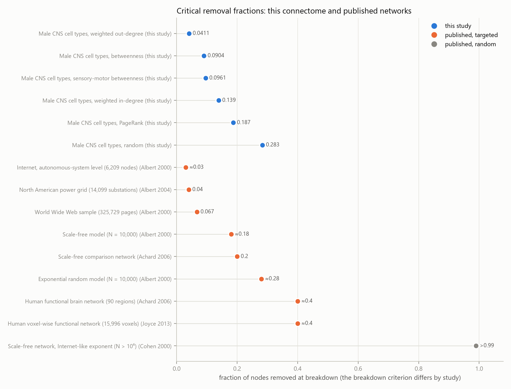
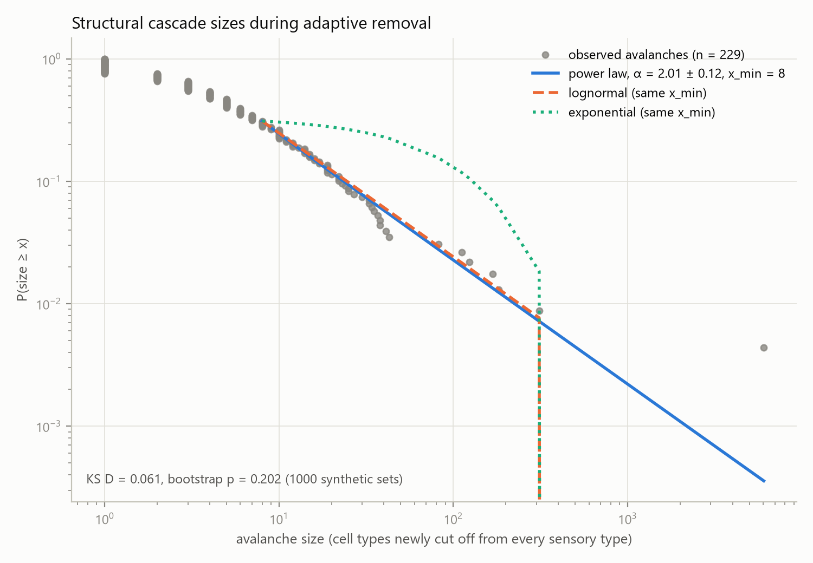
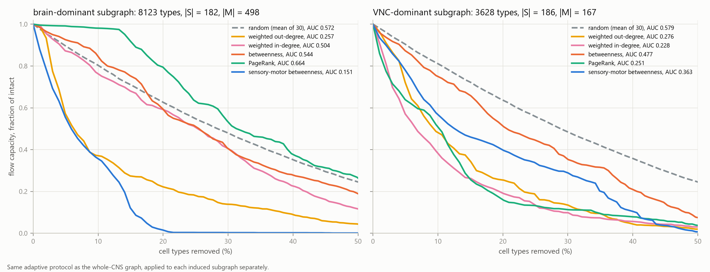
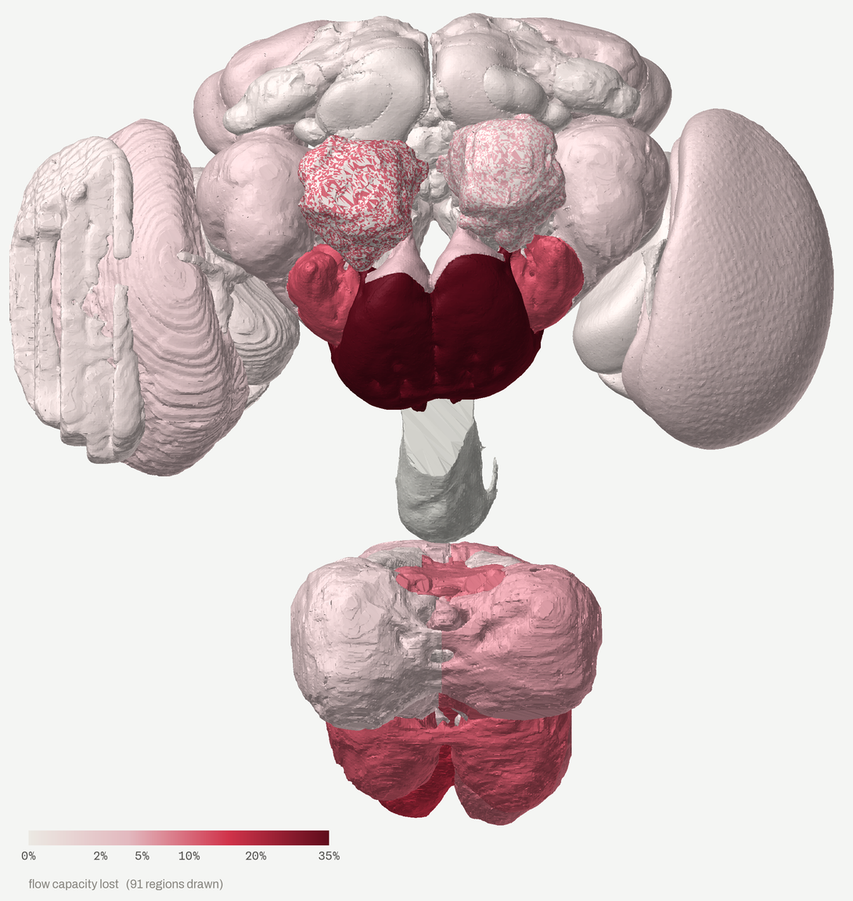
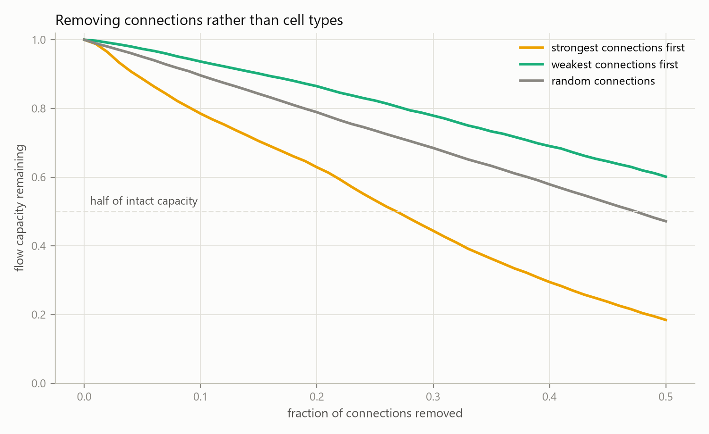
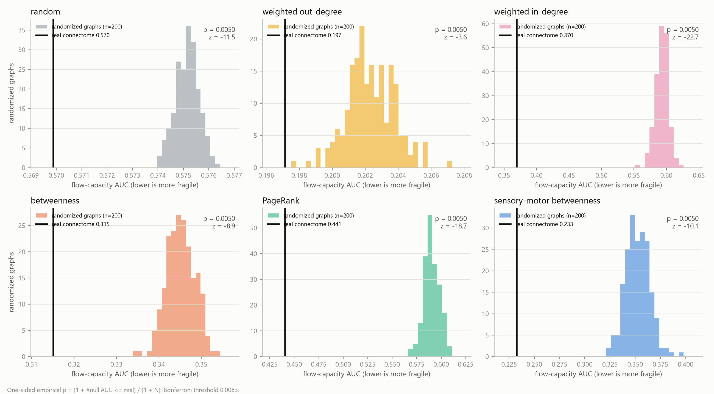
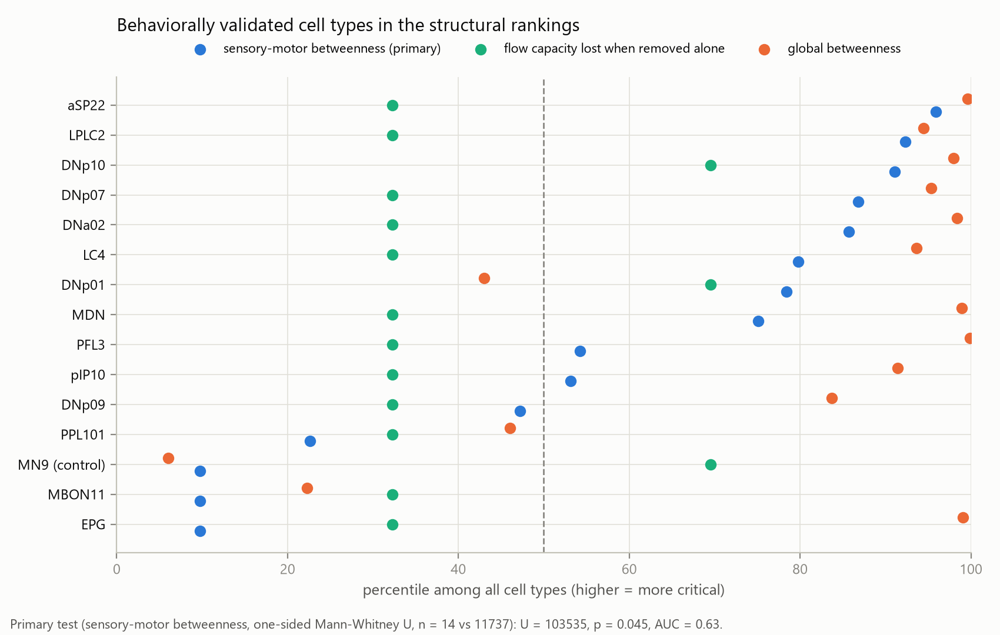

# Abstract

The complete connectome of the adult male *Drosophila* central nervous system (neuPrint `male-cns:v1.0`) was represented as a directed graph of 11,751 cell types and 243,439 connections. Extending percolation analyses of the FlyWire brain (Lin et al. 2024) to brain and nerve cord together, sensory-to-motor routing was measured as the maximum number of edge-disjoint paths from 368 sensory to 665 descending and motor types (10,647 when intact). Under a pre-registered protocol of six adaptive removal strategies, removing cell types by weighted out-degree halves flow capacity after 4.1% of types are gone; random removal requires 28.3% (95% CI 27.7% to 28.9%), and every targeted strategy falls below that interval. Against 200 degree-preserving randomizations of the graph, the real flow-capacity AUC is significantly lower under all six strategies (one-sided empirical p = 0.0050 each; Bonferroni threshold 0.0083). Flow halves long before types become disconnected: at the half-flow point, at most 37 types have lost every path from sensory input, yet under sensory-motor betweenness a single later batch disconnects 6,046 types. Removing the strongest connections first halves flow after 26.8% of connections; removing the weakest half never does. Cascade sizes are not robustly power-law distributed (bootstrap p = 0.202 and 0.036 in two poolings). Removing both hemispheric copies of a type is superadditive for 205 of 4,449 informative types (one-sided Wilcoxon p = 5.2 × 10^−37^) and exactly additive for 4,235. Fourteen behaviorally validated cell types rank above other types in sensory-motor betweenness (one-sided Mann-Whitney p = 0.045; p = 0.10 with the positive control). All results describe a static, type-aggregated wiring diagram.

# Introduction

The robustness of a network to the loss of its parts depends on how those parts are chosen. Albert, Jeong and Barabási (2000) showed that networks with heavy-tailed degree distributions, such as the Internet and the World Wide Web, tolerate the random failure of a large fraction of nodes but fragment quickly when the most connected nodes are removed first. Percolation theory placed these observations on an analytical footing: Cohen et al. (2000) derived the critical fraction of random failures that destroys the giant component of a scale-free network, and Callaway et al. (2000) treated node and edge removal as site and bond percolation on random graphs with arbitrary degree distributions. Later work showed that recomputing centrality after each removal makes attacks more damaging than rankings fixed on the intact network (Holme et al. 2002), and summarized a whole attack curve in a single robustness index (Schneider et al. 2011).

Brain networks have been examined in the same framework. Human functional networks built from resting-state fMRI remain connected under targeted removal of highly connected regions for longer than comparable scale-free networks (Achard et al. 2006), and voxel-level functional networks show a similar resilience (Joyce et al. 2013). Simulated lesions of structural connectivity show that the functional consequences of damage depend strongly on where it falls (Alstott et al. 2009), and edge removal in neural and metabolic networks exposes vulnerabilities not seen under node removal (Kaiser and Hilgetag 2004). These studies worked with regional parcellations of tens to thousands of nodes, mostly with undirected connectivity, and measured robustness through the size of the largest connected component.

At synapse resolution, Lin et al. (2024) applied degree-based node percolation to the FlyWire whole-brain connectome and tracked the largest connected components. This report extends that work to brain and nerve cord together, to directed sensory-to-motor routing rather than component size, to adaptive rankings, and to a pre-registered degree-preserving null model.

Dense reconstructions of the adult *Drosophila* central brain (Scheffer et al. 2020), the whole female brain (Dorkenwald et al. 2024; Schlegel et al. 2024) and the male ventral nerve cord (Takemura et al. 2024) were followed by a connectome of an entire adult central nervous system, brain and nerve cord together, from a male fly (Berg et al. 2026). A whole-CNS graph contains both ends of behavior: the primary sensory neurons that enter the CNS and the descending and motor neurons that leave the brain or drive muscles.

That structure suggests a more specific measure of robustness than the size of a giant component. What matters for behavior is whether sensory input can still be routed to motor output. This report measures that routing directly, as the maximum number of edge-disjoint directed paths from sensory to descending and motor cell types, and asks four questions. First, how quickly does routing capacity collapse under random removal compared with targeted removal by standard centrality measures and by a centrality restricted to sensory-to-motor paths? Second, is the collapse a gradual thinning or an abrupt disconnection, and do structural cascades follow a power law? Third, is the real graph more fragile than degree-preserving randomizations of itself? Fourth, do cell types with experimentally established roles in behavior rank highly on structural criticality? The analysis plan, including hypotheses, test directions and all protocol parameters, was committed to the repository before any percolation run.

# Data and Methods

## Data source

All connectivity was retrieved from neuPrint (Plaza et al. 2022), dataset `male-cns:v1.0` from HHMI Janelia FlyEM and Google Research (Berg et al. 2026), released under the CC-BY 4.0 license and queried with `neuprint-python`. The dataset contains 176,422 neuron records, of which 164,506 carry a cell-type annotation, in 11,751 distinct types. The neuron properties used are `type`, `superclass`, `class`, `somaSide`, `rootSide`, pre- and postsynaptic counts and per-ROI synapse counts (`roiInfo`). The top-level ROIs under the CNS are `CentralBrain`, `Optic(L)`, `Optic(R)`, `VNC` and the neck connective `CV`.

Neuron tables and neuron-to-neuron adjacencies were fetched in chunks of 10,000 source neurons, restricted to connections onto typed neurons, and cached locally. The pipeline uses a neuPrint token from `NEUPRINT_APPLICATION_CREDENTIALS` when one is set and anonymous access to the public dataset otherwise. Neuropil meshes for the regional figure were read from the public `flyem-male-cns` storage bucket.

## Cell-type graph

Neuron-to-neuron synapse counts were summed into type-to-type counts *w*(*u* → *v*), with within-type synapses included in each target's total input. A directed edge *u* → *v* (*u* ≠ *v*) enters the graph when it supplies at least 1% of the target type's input:

$$\frac{w(u \to v)}{\sum_{u'} w(u' \to v)} \geq 0.01 .$$

Self-loops are dropped. Each edge keeps its synapse count as a weight, which is used only by the weighted strategies and the edge attack. Each type takes the superclass held by the majority of its neurons. The resulting graph has 11,751 vertices and 243,439 directed edges (Table 1).

A second, hemisphere-resolved graph was built from the same neuron-level data with one vertex per (type, hemisphere), where the hemisphere is `somaSide` (L, R or M) when present, otherwise `rootSide` (L or R), otherwise unknown. The same 1% rule applies relative to the input of each (type, hemisphere) vertex. This graph is used only for the bilateral analysis.

## Sensory and motor sets

The source set *S* contains the 368 types whose majority superclass is `cb_sensory`, `ol_sensory`, `vnc_sensory`, `sensory_ascending` or `sensory_descending` (3.1% of types). The sink set *M* contains the 665 types whose majority superclass is `descending_neuron`, `cb_motor` or `vnc_motor` (5.7%). Superclasses ending in `_tbc` (annotation to be confirmed), efferent and endocrine neurons, and ascending neurons not annotated as sensory were excluded. Five types in *S* or *M* contain some neurons of another superclass, with a lowest majority share of 0.83. All names were confirmed in a second live query.

| quantity | value |
|---|---|
| typed neurons | 164,506 |
| cell types (vertices) | 11,751 |
| directed edges (at least 1% of target input) | 243,439 |
| sensory types *S* | 368 |
| cb_sensory / ol_sensory / vnc_sensory | 158 / 11 / 169 |
| sensory_ascending / sensory_descending | 26 / 4 |
| descending and motor types *M* | 665 |
| descending_neuron / cb_motor / vnc_motor | 480 / 43 / 142 |
| intact flow capacity *F*(*G*~0~) | 10,647 |
| connected sensory-motor pairs *R*(*G*~0~) | 237,405 of 244,720 |

Table: The cell-type graph and its terminal sets.

## Flow capacity

Let *G* = (*V*, *E*) be the directed type graph. An augmented graph adds a supersource *s*\* with an edge to every *s* ∈ *S* and a supersink *t*\* with an edge from every *m* ∈ *M*. Graph edges receive unit capacity and the terminal edges unbounded capacity. The flow capacity is the maximum flow value

$$F(G) = \max_{f} \sum_{s \in S} f(s^*, s), \quad c(e) = 1 \text{ for } e \in E, \quad c(s^*, s) = c(m, t^*) = \infty .$$

By Menger's theorem and max-flow min-cut duality (Menger 1927; Ford and Fulkerson 1956), *F*(*G*) equals the maximum number of edge-disjoint directed paths from *S* to *M*, and equally the size of the smallest set of edges whose removal separates every motor type from every sensory type. Because edges have unit capacity, the synapse count of a connection does not enter *F*: a connection either exists in the thresholded graph or it does not. Maximum flow was computed with igraph (Csárdi and Nepusz 2006). *F* is the primary, pre-registered metric.

## Reachability

The secondary metric counts connected sensory-motor pairs,

$$R(G) = \left|\{(s, m) \in S \times M : m \text{ is reachable from } s \text{ by a directed path}\}\right| .$$

A removed sensory or motor type loses all of its pairs and paths. Both metrics are normalized by their values on the intact graph, *y*~k~ = *F*(*G*~k~)/*F*(*G*~0~), and likewise for *R*.

## Fragility score

For a removal run with fractions removed *x*~0~ = 0 < *x*~1~ < …, let *K* be the first index with *x*~K~ ≥ 0.5. The fragility score is the trapezoidal area under the normalized curve divided by the fraction range,

$$\mathrm{AUC} = \frac{1}{x_K - x_0} \sum_{k=1}^{K} (x_k - x_{k-1}) \, \frac{y_k + y_{k-1}}{2} ,$$

which is the mean retained fraction over the first half of removals: 1 for a curve that never drops and 0 for one that falls to zero immediately. Lower values mean greater fragility. This is the construction of the robustness index of Schneider et al. (2011), applied to flow capacity rather than to the largest component. With the batch schedule described below, *x*~K~ = 0.5025.

## Critical removal fraction

The critical fraction *f*~c~ is the fraction of types removed when flow capacity first falls below half of its intact value. With *i* the first batch at which *F*~i~ < *F*~0~/2, the primary value interpolates linearly between batches,

$$f_c = x_{i-1} + (x_i - x_{i-1}) \, \frac{F_{i-1} - F_0/2}{F_{i-1} - F_i} ,$$

and the batch-level value *x*~i~ is also reported. Runs continued past 50% removal, with the same batch rule and random stream, until flow fell below half, so that every strategy has a value.

## Centrality scores

Four deterministic scores were computed on the current graph before every batch: weighted out-degree and weighted in-degree (sums of synapse counts on outgoing or incoming edges), betweenness over hop-count shortest paths (Freeman 1977; Brandes 2001), and PageRank with synapse counts as edge weights (Page et al. 1999). The fifth, sensory-motor betweenness, counts only shortest paths that start in *S* and end in *M*,

$$B_{SM}(v) = \sum_{s \in S} \sum_{m \in M} \frac{\sigma_{sm}(v)}{\sigma_{sm}} ,$$

where *σ*~sm~ is the number of shortest *s*-to-*m* paths and *σ*~sm~(*v*) the number passing through *v* as an intermediate vertex. A type that is only ever an endpoint of such paths scores zero.

## Removal protocol

Six strategies were applied: random, weighted out-degree, weighted in-degree, betweenness, PageRank and sensory-motor betweenness. With *N* = 11,751 types and *n*~k~ removed before batch *k*, each batch removes

$$b_k = \left\lceil 0.01 \, (N - n_k) \right\rceil$$

types with the highest current score, ties broken in a seeded random order. All scores are recomputed on the reduced graph before the next batch. After every batch, *F*, *R* and the set of surviving types with no directed path from any surviving sensory type are recorded. The schedule passes 50% after 69 batches, at 50.25% of types removed. Each targeted strategy was run once, since it is deterministic apart from tie-breaking; random removal was run 30 times and summarized by the mean with a Student-t 95% confidence interval.

## Structural avalanches

The avalanche size of a batch is the number of surviving types that have just lost every directed path from the surviving sensory types, excluding the types removed in that batch. Sizes were pooled over batches within the first 50% of removals, in a primary set (one run per strategy, with random trial 0) and a sensitivity set (the targeted runs with all 30 random trials), and fitted with a discrete power law by maximum likelihood, with *x*~min~ chosen to minimize the Kolmogorov-Smirnov distance (Clauset et al. 2009), using the `powerlaw` package (Alstott et al. 2014). Goodness of fit used a semi-parametric bootstrap with 1,000 synthetic data sets, with the power law considered plausible for p ≥ 0.1; alternatives were compared by Vuong's normalized log-likelihood ratio (Vuong 1989). Zero-size batches were excluded from the fit and counted separately.

## Brain and nerve cord subgraphs

Each type was assigned to the brain (`CentralBrain`, `Optic(L)`, `Optic(R)`) or the ventral nerve cord (`VNC`) by the majority of its pre- plus postsynaptic sites in those compartments, ignoring the neck connective. Each induced subgraph kept the whole-CNS edges between its members, received its own terminal sets (the members of *S* and *M* that fall in it) and the full protocol with 30 random trials. For random removal, the trial AUCs of the two subgraphs were compared with a two-sided Welch t-test (Welch 1947). No direction was hypothesized.

## Regional removal

Each type was anchored to the neuropil holding the largest share of its synapses, excluding aggregate compartments and unassigned remainders. All types anchored in a neuropil were removed together, and the loss of flow capacity was compared with *N* = 200 random sets of the same size using the one-sided empirical p = (1 + *k*)/(1 + *N*), where *k* is the number of random sets losing at least as much flow. The smallest attainable value is 1/201 = 0.0050.

## Structure of the intact graph

Out-degree, in-degree and out-strength distributions were fitted with maximum-likelihood power laws with Kolmogorov-Smirnov-selected *x*~min~ and compared with exponential, lognormal and truncated power-law alternatives. The k-core decomposition was computed on the undirected projection (Seidman 1983). For the 13 superclasses with at least 20 types, all types of a superclass were removed at once and compared with 200 random sets of the same size, with p defined as for regional removal.

## Bilateral redundancy

The hemisphere-resolved graph has one vertex per (type, hemisphere). Sensory and motor vertices are those whose type belongs to *S* or *M*. For every type with both a left and a right vertex, flow capacity was measured after removing the left vertex, the right vertex and both, giving impacts *I*~L~, *I*~R~ and *I*~LR~ relative to the intact hemisphere-resolved flow. Types with a non-zero impact in at least one of the three removals enter two pre-registered one-sided Wilcoxon signed-rank tests (Wilcoxon 1945) at α = 0.05, each over the types whose two compared values differ: *I*~LR~ > (*I*~L~ + *I*~R~)/2, and the superadditivity test *I*~LR~ > *I*~L~ + *I*~R~. The superadditivity *I*~LR~ − *I*~L~ − *I*~R~ classifies each type as superadditive (each side backs up the other), additive, or subadditive (the two sides share a bottleneck). Types with *I*~L~ = *I*~R~ = 0 and *I*~LR~ > 0 are fully insured by their contralateral homolog.

## Synthetic-lethal pairs

The single-removal impact is *I*(*v*) = *F*(*G*~0~) − *F*(*G*~0~ − *v*). The pre-registered candidate pool contains the 250 types with the highest *I*(*v*) per incident edge (in-degree plus out-degree), ties broken by higher sensory-motor betweenness. Every pair in the pool was removed together, and pairs were ranked by the synergy

$$\Sigma(u, v) = I(u, v) - I(u) - I(v) ,$$

where *I*(*u*, *v*) is the flow lost when both types are removed.

## Edge attack

Connections were removed in batches of 1% of the 243,439 edges, up to half of them, in order of decreasing synapse count, increasing synapse count, or at random, with ties broken by a seeded random key. The random order was drawn five times. Because flow capacity gives every edge unit capacity, this tests whether the connections carrying the most synapses are also the ones carrying the routing (Kaiser and Hilgetag 2004).

## Hidden bottlenecks

The pre-registered search looked for types in the bottom half of all types by total degree (in-degree plus out-degree, so a partner connected in both directions counts twice) and by PageRank but in the top 1% by sensory-motor betweenness, all on the intact graph. Percentiles are mid-rank. The most extreme example is the candidate with the highest sensory-motor betweenness.

## Null model

**Hypotheses.** For each strategy *k*, the pre-registered directional hypothesis *H*~k~ states that the real graph's flow-capacity AUC is lower (more fragile) than that of degree-preserving randomized graphs under the same strategy.

**Randomized graphs.** Each of *N* = 200 null graphs is produced from the real type graph by 10 × |*E*| in- and out-degree-preserving edge swaps on simple graphs (`igraph.Graph.rewire`; Maslov and Sneppen 2002), with seed 20260915 + 100000 + *i* for null graph *i*. Every type keeps its exact in-degree and out-degree. Each type's set of outgoing synapse counts is shuffled onto its new outgoing edges, which preserves out-strength while randomizing downstream partners; in-strength is not preserved. Sensory and motor types keep their labels.

**Protocol and test.** Every null graph receives the identical protocol: six adaptive strategies, 1% batches with recomputed scores, AUC over the first 50% of removals, and 30 random-removal trials averaged into that graph's random-strategy score. Curves are normalized by the null graph's own intact flow capacity and reachable pairs. The one-sided empirical p-value is

$$p_k = \frac{1 + \#\{i : \mathrm{AUC}^{\mathrm{null}}_{i,k} \leq \mathrm{AUC}^{\mathrm{real}}_k\}}{1 + N} ,$$

tested at the Bonferroni threshold α = 0.05/6 = 0.0083; with *N* = 200 the smallest attainable value is 1/201 = 0.0050. The null mean, standard deviation and range and the z-score of the real AUC are reported, and the same test on reachability AUC is secondary. A non-significant result is reported as such, and no parameter may change after the null distribution is seen.

## Literature validation

Fourteen cell types with published activation or silencing evidence for a specific behavior were fixed before scoring: the giant fiber DNp01, the moonwalker descending neurons MDN, the looming-sensitive visual projection neurons LPLC2 and LC4, the landing neurons DNp07 and DNp10, DNp09 (P9), the courtship neurons pIP10 and aSP22, the steering neuron DNa02, the compass neurons EPG, the steering neurons PFL3, and the mushroom body neurons MBON11 and PPL101. Descending neuron nomenclature follows Namiki et al. (2018). MDN is the connectome type for the moonwalker descending neurons, P9 is scored as DNp09, and aSP22 is the connectome name for the neuron published as DNa12. The motor neuron MN9 was named as a positive control and excluded from the primary test. The primary score is sensory-motor betweenness on the intact graph, tested with a one-sided Mann-Whitney U test (Mann and Whitney 1947) against all other types at α = 0.05. Secondary scores are single-removal flow loss and global betweenness. Two sensitivity variants were specified: DNp71, which also carries the hemibrain label DNp09, in place of DNp09, and MN9 included.

## Pre-registration

The analysis plan was committed in `0e72491`, after the graph was built and before any percolation run on the real or randomized graphs; the order can be checked in the repository history. It fixes the graph, the terminal sets, both metrics, the removal protocol, the AUC window, the expected sanity check (every targeted strategy below random on both metrics), the directional null-model hypotheses with their test and correction, the *f*~c~ definition, the avalanche fitting procedure, the curated literature list with its test and sensitivity variants, the brain and nerve cord classification rule, the synthetic-lethal pair search, the bilateral redundancy tests and the hidden-bottleneck criteria. A later commit (`a3a727e`) restated the directional null-model hypotheses before any randomized graph was scored.

The following analyses were added afterwards and are exploratory: the comparison with published thresholds, the full single-type removal table, disconnection across the type population, regional removal, the structure of the intact graph including superclass removal, and the edge attack.

## Software

| package | version |
|---|---|
| Python | 3.12.12 |
| neuprint-python | 0.6.3 |
| igraph | 1.0.0 |
| NumPy / SciPy / pandas | 2.5.3 / 1.18.1 / 3.0.5 |
| powerlaw | 2.0.0 |
| networkx | 3.6.1 |
| pyarrow | 25.0.1 |
| matplotlib | 3.11.2 |
| pandoc / typst | 3.11 / 0.15.1 |

Table: Software versions.

Software versions are listed in Table 2, and all dependencies are pinned in `requirements.txt`. The pipeline is a set of Python modules in `pipeline/`, run through `make` (Table 3).

| target | what it runs |
|------------------|----------------------------------------------------------------------------------|
| `make data` | schema discovery, sensory and motor sets, type graph |
| `make analyze` | percolation, critical thresholds, single removal, avalanches |
| | brain and nerve cord, synthetic-lethal pairs, bilateral redundancy |
| | hidden bottleneck, structure profile, edge attack |
| `make validate` | null model, literature validation |
| `make context` | comparison with published thresholds |
| `make hero` | regional removal, neuropil rendering, type atlas |
| `make export` | data for the interactive site |
| `make paper` | this report, with pandoc and the typst engine |
| `make test` | unit tests (`pytest`) |
| `make verify` | checks of every committed result against its invariants |
| `make poster` | the one-page poster |
| `make readme` | README figures, drawn from `results/` |
| `make captures` | site animations and phone screenshots, from a running build of the site |

Table: Make targets.

`make reproduce` runs `data`, `analyze`, `validate`, `context`, `hero`, `export`, `paper`, `test` and `verify` in that order. `WORKERS` (default 4) sets the number of worker processes and `NULLS` (default 200) the number of randomized graphs. Unit tests cover type-graph construction, the connectivity metrics, the removal strategies, critical-threshold interpolation, null-model rewiring, the bilateral, synthetic-lethal, hidden-bottleneck, structure-profile, edge-attack, regional and literature analyses, the type atlas, the hero-image geometry and the site export, and run in continuous integration on every push. Every number reported here is read from result files written by these modules.

**Randomness.** The base seed is 20260915. Percolation trial *t* of strategy *j* (in the order random, weighted out-degree, weighted in-degree, betweenness, PageRank, sensory-motor betweenness, counting from zero) uses 20260915 + 1000 *j* + *t*; null graph *i* uses 20260915 + 100000 + *i*; the regional same-size draws use the base seed, the superclass draws base + 7, type placement in the atlas base + 11 and edge attack trial *t* base + 31 *t*; the avalanche bootstrap uses the base seed for the primary set and base + 1 for the sensitivity set. Every percolation run is cached as a separate file, so an interrupted computation resumes without changing results.

**Runtime.** The analyses were run on a laptop with an 8-core, 16-thread CPU. Fetching the neuron-level adjacency from neuPrint is the only network-bound step and is cached per chunk. The 35 percolation runs on the whole-CNS graph completed within about twenty minutes between the first and the last finished run. The null model dominates the total cost: each randomized graph repeats all 35 runs, so 200 null graphs require 7,000 percolation runs, about 200 times the cost of the real-graph protocol.

**Availability.** Code, derived results, figures and site data are available at <https://github.com/dhruvin-sarkar/fault-lines> under the MIT license, with citation metadata in `CITATION.cff`; the raw neuPrint cache is not redistributed and is rebuilt by `make data`. An interactive presentation of the results is available at <https://dhruvin-sarkar.github.io/fault-lines/>.

# Results

## Targeted removal collapses sensory-to-motor routing

Every targeted strategy degrades both metrics faster than random removal (Figure 1, Table 4), so the pre-registered sanity check passes in all ten comparisons. For flow capacity, weighted out-degree is the most damaging order (AUC 0.197), followed by sensory-motor betweenness (0.233), betweenness (0.315), weighted in-degree (0.370) and PageRank (0.441), against 0.570 (95% CI 0.564 to 0.576) for random removal. The ranking differs for reachability: sensory-motor betweenness (0.256) and betweenness (0.267) disconnect sensory-motor pairs fastest, and weighted out-degree is third (0.349).

The two metrics diverge because they respond to different damage. Weighted out-degree removes the types with the most outgoing synapses first, and flow capacity drops steeply in the first batches (to 0.590 of intact after 2.99% of types are removed) while reachability falls more slowly (0.831). Betweenness-based orders remove relays through which many pairs communicate, and reachability falls in discrete steps as groups of pairs lose their last route.

At the first batch beyond 50% removal (50.25%), random removal retains on average 22.7% of flow capacity and 24.6% of connected pairs over 30 trials. Sensory-motor betweenness leaves 0.21% of flow and 0.01% of pairs; weighted out-degree leaves 2.7% and 8.4%.

{width=95%}

| strategy | AUC, flow | AUC, reachability | *f*~c~, interpolated | *f*~c~, first batch below half |
|---|---|---|---|---|
| weighted out-degree | 0.197 | 0.349 | 0.0411 | 0.0492 |
| sensory-motor betweenness | 0.233 | 0.256 | 0.0961 | 0.1051 |
| betweenness | 0.315 | 0.267 | 0.0904 | 0.0960 |
| weighted in-degree | 0.370 | 0.484 | 0.1387 | 0.1407 |
| PageRank | 0.441 | 0.461 | 0.1875 | 0.1910 |
| random, mean of 30 | 0.570 | 0.586 | 0.2832 | 0.2870 |
| random, 95% CI | 0.564 to 0.576 | 0.581 to 0.591 | 0.2774 to 0.2890 | 0.2811 to 0.2929 |

Table: Fragility of sensory-to-motor routing under six removal strategies. Random removal is summarized by the mean and Student-t 95% confidence interval over 30 trials.

## Critical removal fractions

Under weighted out-degree removal, flow capacity halves after 4.1% of cell types are removed (*f*~c~ = 0.0411); random removal requires 28.3% (*f*~c~ = 0.2832, 95% CI 0.2774 to 0.2890), about 6.9 times as many (Table 4). Betweenness (0.0904) and sensory-motor betweenness (0.0961) come next, then weighted in-degree (0.1387) and PageRank (0.1875). All five targeted values lie below the lower bound of the random-removal confidence interval. The interpolated and batch-level values differ by at most 0.009 and give the same ordering. Across the 30 random trials, *f*~c~ ranges from 0.2553 to 0.3127.

## Comparison with published attack-tolerance thresholds

Table 5 and Figure 2 place these values beside thresholds printed in the attack-tolerance literature. The criteria differ: published values track the largest connected cluster, usually on undirected graphs and often with rankings fixed on the intact network, whereas *f*~c~ here is a directed source-to-sink capacity under recomputed rankings. A source-to-sink capacity is limited by the narrowest cut between two designated sets and can halve long before a giant component disappears. The comparison therefore supports only a qualitative statement.

With that caveat, the 4.1% threshold under weighted out-degree lies in the range reported for engineered hub-dominated networks under degree or load attack (the AS-level Internet at about 3%, a Web sample at 6.7%, and the North American power grid, which loses up to 60% of generator-to-substation connectivity when 4% of substations are removed by load), and well below the roughly 40% reported for human functional brain networks. The power-grid study is the closest analogue, because it also measures connectivity from a source set to a sink set. Cohen et al. (2001) show targeted breakdown after a few percent of sites only as a curve, and Jeong et al. (2001) report no removal fraction for the yeast protein network, so neither is tabulated.

| network | removal | breakdown criterion | fraction removed | source |
|------------------------------|-----------------|----------------------|------------|-------------------|
| male CNS cell types | adaptive weighted out-degree | flow capacity halved | 0.041 | this study |
| male CNS cell types | random | flow capacity halved | 0.283 | this study |
| Internet, AS level (6,209 nodes) | by degree | largest cluster fragments | about 0.03 | Albert et al. (2000) |
| World Wide Web sample (325,729 pages) | by out-degree | largest cluster fragments | 0.067 | Albert et al. (2000) |
| scale-free model (N = 10,000) | by degree | largest cluster fragments | about 0.18 | Albert et al. (2000) |
| exponential random model (N = 10,000) | by degree | largest cluster fragments | about 0.28 | Albert et al. (2000) |
| North American power grid (14,099 substations) | by load | up to 60% loss of connectivity | 0.04 | Albert et al. (2004) |
| human functional brain network (90 regions) | by degree | largest cluster halved | about 0.4 | Achard et al. (2006) |
| scale-free comparison network | by degree | largest cluster halved | 0.2 | Achard et al. (2006) |
| human voxel-wise functional network (15,996 voxels) | recalculated centrality | first large giant-component reduction | about 0.4 | Joyce et al. (2013) |
| scale-free network, Internet-like exponent (N > 10^6^) | random | spanning cluster vanishes | more than 0.99 | Cohen et al. (2000) |

Table: Critical removal fractions in this connectome and values printed in published attack-tolerance studies. The breakdown criteria are not equivalent.

{width=85%}

## Single-type removal

Removing each of the 11,751 types alone reduces flow capacity for 4,166 types and leaves it unchanged for 7,585. The largest single-type losses all belong to sensory types: SApp (310 paths, 2.9% of intact flow), SNppxx (216), SApp10 (166) and SApp09,SApp22 (164). Of the 368 sensory types, 350 reduce flow when removed; of the 10,718 types outside *S* and *M*, 3,505 do, and the largest such loss is 31 paths (lLN2T_b). Removing a single descending or motor type costs at most 16 paths.

Only two types outside *S* and *M* disconnect any sensory-motor pair when removed alone: AMMC029 and ANXXX264 each disconnect 665 pairs, which equals |*M*|, and in both cases these are all the pairs of one sensory type. Routing through the CNS is therefore highly redundant at the level of individual types: almost no single interneuron type is indispensable, and large losses require removing many types together.

## Structural avalanches

In the primary set, 185 of 414 batches produced no avalanche and 229 positive sizes were fitted (Table 6, Figure 3). The fit gives α = 2.011 ± 0.120 above *x*~min~ = 8 (71 sizes), KS distance 0.0607 and bootstrap p = 0.202, so the power law is not rejected. It is favored over an exponential (*R* = +2.628, p = 0.009) but cannot be distinguished from a lognormal (*R* = −1.007, p = 0.314) or a truncated power law (*R* = +0.002, p = 0.997). In the sensitivity set, which pools all 30 random trials with the targeted runs, the power law is rejected (α = 1.872 ± 0.078, *x*~min~ = 4, bootstrap p = 0.036), and again the lognormal is not distinguishable (p = 0.752). The conclusion does not survive a change in which runs are pooled, and the data do not establish scale-free cascades.

| quantity | primary (one run per strategy) | sensitivity (all random trials) |
|---|---|---|
| batches / zero-size / fitted | 414 / 185 / 229 | 2,415 / 2,073 / 342 |
| largest avalanche (types) | 6,046 | 6,046 |
| exponent α | 2.011 ± 0.120 | 1.872 ± 0.078 |
| *x*~min~ / sizes in tail | 8 / 71 | 4 / 125 |
| KS distance | 0.0607 | 0.0595 |
| bootstrap p (1,000 sets) | 0.202 | 0.036 |
| LR vs exponential, *R* (p) | +2.628 (0.009) | +2.411 (0.016) |
| LR vs lognormal, *R* (p) | −1.007 (0.314) | −0.316 (0.752) |
| LR vs truncated power law, *R* (p) | +0.002 (0.997) | −0.328 (0.894) |

Table: Power-law fits to structural avalanche sizes. *R* > 0 favors the power law.

The tail is dominated by a single event. In the sensory-motor betweenness run, the batch that takes removal from 30.5% to 31.2% of types cuts off 6,046 types at once. By then routing is already nearly exhausted: flow capacity is 356 before the batch and 273 after (3.3% and 2.6% of intact), and connected pairs fall from 1,240 to 756. Summed over the primary runs, 6,919 types are cut off under sensory-motor betweenness, 831 under weighted out-degree, 523 under betweenness, 289 under weighted in-degree, 35 under PageRank and 2 under random removal. These totals count each type when it is cut off, including types that are removed later, so they exceed the number disconnected at the end of a run.

{width=75%}

These cascades are structural: no neural activity is simulated. Power-law distributed avalanches of spiking activity in cortical tissue (Beggs and Plenz 2003) concern a different quantity, and neither result bears on the other.

## Disconnection across the whole type population

Replaying each strategy's removal sequence (the targeted runs and random trial 0) and counting, after every batch, the surviving types with no directed path from any surviving sensory type shows when loss of routing capacity turns into disconnection (Table 7). In the intact graph every type is reachable from sensory input.

At each strategy's own half-flow batch, few types are disconnected: 23 under weighted out-degree (at 4.92% removed), 37 under weighted in-degree, 2 under betweenness, 4 under PageRank and none under sensory-motor betweenness or random removal. The first halving of routing capacity is therefore a thinning of parallel routes, not a loss of reachability. Beyond that point the strategies separate sharply. After 50.25% of types are removed, 5,846 types remain; under sensory-motor betweenness 5,306 of them (90.8%) have no path from any sensory type, against 662 under weighted out-degree, 520 under betweenness, 257 under weighted in-degree, 35 under PageRank and 1 under random removal. Sensory-motor betweenness disconnects no surviving type up to 10.51% removal and only 18 up to 20.73%; almost all of its disconnection arrives with the cascade described above.

| strategy | at own half-flow batch (fraction removed) | at 10.51% removed | at 20.73% removed | at 50.25% removed |
|---|---|---|---|---|
| weighted out-degree | 23 (0.0492) | 42 | 94 | 662 |
| weighted in-degree | 37 (0.1407) | 22 | 47 | 257 |
| betweenness | 2 (0.0960) | 2 | 11 | 520 |
| PageRank | 4 (0.1910) | 1 | 4 | 35 |
| sensory-motor betweenness | 0 (0.1051) | 0 | 18 | 5,306 |
| random (trial 0) | 0 (0.2836) | 0 | 0 | 1 |

Table: Surviving cell types with no directed path from any surviving sensory type. At 50.25% removed, 5,846 types survive under every strategy.

## Brain versus ventral nerve cord

All 11,751 types were classified: 8,123 as brain-dominant and 3,628 as VNC-dominant (Table 8, Figure 4).

| | brain-dominant | VNC-dominant |
|--------------------------------------------|----------------------------|----------------------------|
| cell types / edges | 8,123 / 157,374 | 3,628 / 66,700 |
| sensory types / descending and motor types | 182 / 498 | 186 / 167 |
| intact flow capacity | 3,765 | 3,066 |
| connected pairs | 88,644 of 90,636 | 29,714 of 31,062 |
| AUC flow: random (95% CI) | 0.572 (0.564 to 0.579) | 0.579 (0.573 to 0.586) |
| AUC flow: weighted out-degree | 0.257 | 0.276 |
| AUC flow: weighted in-degree | 0.504 | 0.228 |
| AUC flow: betweenness | 0.544 | 0.477 |
| AUC flow: PageRank | 0.664 | 0.251 |
| AUC flow: sensory-motor betweenness | 0.151 | 0.363 |
| *f*~c~: random / weighted out-degree | 0.284 / 0.063 | 0.288 / 0.093 |
| *f*~c~: weighted in-degree / sensory-motor betweenness | 0.253 / 0.059 | 0.066 / 0.126 |
| *f*~c~: betweenness / PageRank | 0.255 / 0.313 | 0.206 / 0.102 |

Table: Brain-dominant and VNC-dominant subgraphs under the same protocol.

Under random removal the two subgraphs do not differ significantly (Welch two-sided t = −1.54, p = 0.13 for flow AUC; t = 1.10, p = 0.27 for reachability AUC; 30 trials each). The targeted strategies behave very differently. In the brain subgraph, sensory-motor betweenness is the most damaging order (AUC 0.151, *f*~c~ 0.059), betweenness (0.544) is close to random, and PageRank removal (0.664) is less damaging to flow than random removal. In the nerve cord, weighted in-degree (0.228, *f*~c~ 0.066) and PageRank (0.251) are the most damaging, and sensory-motor betweenness is comparatively mild (0.363). Weighted out-degree is effective in both (0.257 and 0.276). Which cell types are structurally critical therefore depends on the circuit, and a centrality that finds them in one part of the CNS need not find them in another. The subgraphs differ in size, density and the composition of *S* and *M*, and the targeted strategies are single runs, so these differences describe two graphs rather than estimating an effect.

{width=95%}

## Regional impact

Of the 11,751 types, 11,750 were anchored, across 91 neuropils. This analysis is exploratory. The gnathal ganglia (GNG; 1,237 types, including 79 sensory and 294 descending or motor types) produce the largest loss, 34.7% of intact flow against 20.6% for random sets of the same size (p = 0.005). Fourteen of the 91 neuropils exceed their same-size null at p < 0.05, eight of them at the smallest attainable value, 1/201. A Bonferroni correction across 91 tests requires p < 0.05/91 = 0.00055, which no neuropil can reach with 200 draws, so these values rank regions rather than establish significance. Neuropils that hold many terminal types (the GNG, the leg neuromeres, the saddle, the antennal lobes) dominate the ranking, as expected when removing them deletes sources and sinks. The eight mushroom body lobe neuropils with anchored types, aL, a'L and gL on both sides plus bL(L) and b'L(L), whose anchored types include no sensory or motor types, lose no flow at all; in total 25 of the 91 neuropils lose none. Table 9 lists the ten largest losses, and Figure 5 renders the full table on the neuropil meshes.

| neuropil | types | sensory | descending or motor | flow lost | same-size random | p |
|---|---|---|---|---|---|---|
| GNG | 1,237 | 79 | 294 | 34.7% | 20.6% | 0.005 |
| LegNp(T3)(R) | 389 | 27 | 10 | 15.4% | 6.7% | 0.005 |
| ANm | 584 | 28 | 77 | 11.4% | 10.0% | 0.214 |
| SAD | 319 | 34 | 33 | 10.6% | 5.5% | 0.005 |
| LegNp(T2)(L) | 456 | 7 | 10 | 9.9% | 7.8% | 0.070 |
| LegNp(T2)(R) | 131 | 16 | 8 | 9.8% | 2.2% | 0.005 |
| Ov(L) | 115 | 24 | 1 | 9.2% | 2.0% | 0.005 |
| AL(R) | 226 | 50 | 1 | 8.9% | 3.8% | 0.005 |
| LegNp(T3)(L) | 366 | 11 | 8 | 7.8% | 6.3% | 0.129 |
| IntTct | 234 | 8 | 11 | 7.6% | 4.1% | 0.015 |

Table: The ten neuropils whose anchored types carry the most flow capacity.

{width=60%}

## The structure the attacks act on

**Degree tails.** The out-degree distribution (number of target types) has median 16 and maximum 389; the power law (α = 2.97 above *x*~min~ = 27) is favored over the exponential (*R* = +3.24, p = 0.001) but disfavored against the lognormal (*R* = −5.06, p = 4 × 10^−7^) and the truncated power law (Table 10). The in-degree distribution is narrow (median 21, maximum 46), fits poorly (KS distance 0.305) and is better described by every alternative; the 1% input threshold, which allows at most 100 input types per target, contributes to this. Out-strength spans three orders of magnitude (median 1,975, maximum 2,362,060 synapses); a truncated power law fits better than a pure power law (*R* = −2.39, p = 0.009) and the lognormal cannot be distinguished (p = 0.34). The graph therefore has heavy out-degree and out-strength tails, consistent with targeting the highest-output types being effective; whether the degree sequence accounts for it is what the null model tests. It is not scale-free in the strict sense.

| measure | types | median | maximum | α | *x*~min~ | types in tail | preferred over power law (p < 0.1) |
|-------------------|--------|--------|----------|------|--------|---------|--------------------------------|
| out-degree (partner types) | 11,112 | 16 | 389 | 2.97 | 27 | 2,975 | lognormal, truncated power law |
| in-degree (partner types) | 11,750 | 21 | 46 | 2.90 | 13 | 10,949 | exponential, lognormal, truncated power law |
| out-strength (synapses) | 11,112 | 1,975 | 2,362,060 | 1.96 | 12,616 | 712 | truncated power law |

Table: Degree and strength distributions of the intact graph. Counts exclude types with a value of zero.

**Core structure.** The k-core decomposition reaches k = 23, and 9,367 of the 11,751 types (79.7%) belong to that deepest core. Coreness correlates weakly with out-strength (Spearman ρ = 0.24, p = 1.1 × 10^−157^). The graph is a large, dense core with a thin periphery rather than a nested hierarchy of small cores.

**Removing a whole superclass.** Removing descending neurons (66.4% of flow lost), VNC sensory neurons (50.1%), central-brain sensory neurons (32.5%), VNC motor neurons (16.6%) or ascending sensory neurons (13.6%) is far more damaging than removing random sets of equal size (p = 0.005 each; Table 11), which largely restates that these classes contain the terminals. The informative rows are the non-terminal classes. Ascending neurons, which belong to neither *S* nor *M*, cost 34.7% of flow against 9.7% for random sets (p = 0.005), consistent with ascending pathways from nerve cord to brain carrying a large share of the routes. Central-brain intrinsic neurons, by contrast, cost 49.3% against 82.4% for random sets of 6,605 types (p = 1.000), and the optic-lobe intrinsic, visual projection and visual centrifugal classes each cost less than 1%. The small contribution of visual pathways likely reflects that the eleven visual sensory types provide few sources, whatever the number of neurons they contain (see Limitations).

| superclass | types | neurons | flow lost | same-size random | p |
|---|---|---|---|---|---|
| descending_neuron | 480 | 1,310 | 66.4% | 8.2% | 0.005 |
| vnc_sensory | 169 | 5,598 | 50.1% | 2.9% | 0.005 |
| cb_intrinsic | 6,605 | 31,280 | 49.3% | 82.4% | 1.000 |
| vnc_intrinsic | 2,777 | 12,943 | 47.0% | 42.9% | 0.040 |
| ascending_neuron | 563 | 1,865 | 34.7% | 9.7% | 0.005 |
| cb_sensory | 158 | 4,756 | 32.5% | 2.7% | 0.005 |
| vnc_motor | 142 | 699 | 16.6% | 2.4% | 0.005 |
| sensory_ascending | 26 | 536 | 13.6% | 0.4% | 0.005 |
| ol_intrinsic | 271 | 89,358 | 0.6% | 4.7% | 1.000 |
| cb_motor | 43 | 106 | 0.4% | 0.7% | 0.776 |
| visual_projection | 346 | 9,202 | 0.4% | 5.9% | 1.000 |
| visual_centrifugal | 108 | 562 | 0.1% | 1.8% | 1.000 |
| vnc_efferent | 27 | 78 | 0.0% | 0.4% | 1.000 |

Table: Flow capacity lost when every type of a superclass is removed at once, against 200 random sets of the same size.

## Bilateral redundancy

The hemisphere-resolved graph has 23,073 vertices (11,449 left, 11,422 right, 161 midline and 41 of unknown side) and 490,884 edges, with an intact flow capacity of 21,844. Of the 11,281 types with both a left and a right vertex, 4,449 have a non-zero impact in at least one of the three removals.

Both pre-registered tests are significant. Removing both sides costs more flow than the mean of the two single-side removals (W = 9,899,025 over 4,449 types with unequal values, z = 57.82, one-sided p < 10^−323^, log~10~ p = −728.2 from the normal approximation, since the p value is below the smallest positive double). Removing both sides also costs more than the sum of the two single-side removals (W = 22,235.5 over 214 types with unequal values, z = 12.66, one-sided p = 5.2 × 10^−37^). The effect is rare and small, however. Of the 4,449 informative types, 205 are superadditive, 4,235 additive and 9 subadditive, and the largest superadditivity is +6 paths (SApp10, whose left and right removals cost 179 and 162 paths and whose joint removal costs 347). Twelve types lose no flow when either side is removed alone but do lose flow when both are removed, so for these the contralateral homolog is complete structural insurance. Eight of the nine types with superadditivity of +3 or more are sensory types; the exception is the ascending type ANXXX296 (Table 12). Below them, 35 types tie at +2, of which 11 are sensory.

| type | left removed | right removed | both removed | superadditivity |
|---|---|---|---|---|
| SApp10 | 179 | 162 | 347 | +6 |
| LgLG1b | 31 | 40 | 75 | +4 |
| ORN_DC4 | 21 | 24 | 49 | +4 |
| SApp | 324 | 297 | 624 | +3 |
| LgLG3 | 60 | 59 | 122 | +3 |
| SNxx04 | 58 | 61 | 122 | +3 |
| LgLG1a | 39 | 41 | 83 | +3 |
| LB1c | 42 | 32 | 77 | +3 |
| ANXXX296 | 9 | 9 | 21 | +3 |

Table: The most superadditive types in the hemisphere-resolved graph, with the flow capacity lost (paths) when the left vertex, the right vertex or both are removed.

## Synthetic-lethal pairs

All 31,125 pairs were evaluated. All 250 pool members have *I*(*v*) > 0; 245 are sensory types, 4 are descending or motor types and 1 is an interneuron type, because dividing flow impact by degree favors sources, whose removal deletes their own paths. Of the pairs, 585 have positive synergy, 39 negative and 30,501 zero. Synergy is small relative to the single impacts: the largest is +12 paths (SNppxx with SNta29, single impacts 216 and 155, joint impact 383), and only 14 pairs exceed +5. Every positive-synergy pair consists of two sensory types (the top 25 are all VNC sensory or ascending sensory types), and every negative pair includes at least one type outside *S*.

Positive synergy means that the two types substitute for each other: each removal alone is partly absorbed by the other, and removing both costs more than the two separate losses. Types in series that share a downstream bottleneck produce the opposite, subadditivity, because once the shared capacity is gone, removing the second type adds little. For sensory types, the substitution is largely a property of how flow treats the sensory end of the network. Many sensory types converge on the same downstream types, whose incoming capacity is the binding limit. Removing one sensory type lets another fill that capacity, while removing both leaves it unfilled. The positive synergy between sensory types therefore reflects substitution at the entry points into shared downstream capacity, and it does not show independent parallel pathways deeper in the circuit. The superadditive sensory types of the bilateral analysis can be read the same way. The pool definition fixed in advance does not reach the interneuron pairs the analysis was intended to find; a pool restricted to non-terminal types would be needed for that question.

## Removing connections instead of cell types

Removing the strongest connections first halves flow capacity after 26.8% of connections are removed (Figure 6). Random removal halves it after a mean of 47.6% over five random orders, with individual trials ranging from 47.2% to 48.0%. Removing the weakest connections first never halves flow within 50%: after 49.99% of connections are gone, 60.1% of flow capacity and 94.5% of connected pairs remain. At the same point strongest-first removal leaves 18.4% of flow and 51.0% of pairs, and random removal (trial 0) leaves 47.2% of flow and 99.2% of pairs.

Synapse count and routing capacity are aligned but far from identical. Strong connections carry a disproportionate share of edge-disjoint routes, yet the weakest half of the connections, all of which passed the 1% input threshold, can be deleted with less loss of capacity than a random half. Weakest-first removal nonetheless disconnects more sensory-motor pairs than random removal (94.5% against 99.2% retained), so some pairs depend on thin connections as their only route.

{width=75%}

## A hidden bottleneck

Four types have below-median degree and PageRank and top-1% sensory-motor betweenness (Table 13).

| type | superclass | degree (percentile) | PageRank percentile | *B*~SM~ (percentile) |
|---|---|---|---|---|
| ALIN7 | cb_intrinsic | 34 (45.7) | 9.8 | 1,881 (99.83) |
| ALON3 | cb_intrinsic | 29 (30.0) | 36.1 | 1,558 (99.72) |
| GNG354 | cb_intrinsic | 32 (39.5) | 15.5 | 952 (99.28) |
| ANXXX264 | ascending_neuron | 34 (45.7) | 38.8 | 865 (99.20) |

Table: Types with below-median degree and PageRank and top-1% sensory-motor betweenness.

The most extreme is ALIN7, a central-brain intrinsic type of two neurons with 19 input and 15 output partner types (total degree 34, against a median of 36) and a PageRank percentile of 9.8. It ranks 21st of 11,751 types by sensory-motor betweenness (1,881.3, equivalent to 0.79% of the 237,405 connected pairs). Its five strongest inputs are all central-brain sensory types (ORN_VA1v, 1,066 synapses; ORN_VA1d, 761; JO-FV, BM_InOm and BM_Vib), and its strongest outputs are the central-brain intrinsic types il3LN6 (1,396 synapses), DL3_lPN, VA1d_adPN and VA1v_adPN and the ascending neuron type AN01A089.

Concentrating shortest routes is not the same as being indispensable. Removing ALIN7 alone disconnects no sensory-motor pair and reduces flow capacity by 9 of 10,647 paths, but it lengthens the shortest route for 849 pairs: parallel routes exist, and they are longer. ANXXX264, by contrast, is one of the two non-terminal types whose single removal disconnects any pair. Whether flies depend on any of these types has not been tested.

## Comparison with degree-preserving randomized graphs

All 200 randomized graphs completed the full protocol, so the test is the pre-registered one. *H*~k~ is supported for every strategy: under all six, the real flow-capacity AUC is significantly lower than that of the randomized graphs at the Bonferroni threshold of 0.0083 (p = 0.0050 each; Table 14, Figure 7). No randomized graph reached an AUC at or below the real one under every strategy, so p equals the smallest attainable value, 1/201 = 0.0050; the z-scores convey the size of the difference better than p. The z-scores of the real AUCs range from −22.7 to −3.6. The secondary test on reachability AUC is significant for four of the six strategies (weighted in-degree, betweenness, PageRank and sensory-motor betweenness).

| strategy | real AUC | randomized mean ± SD | randomized range | at or below real | z | p | result |
|---|---|---|---|---|---|---|---|
| random | 0.570 | 0.575 ± 0.0005 | 0.574 to 0.576 | 0 / 200 | −11.5 | 0.0050 | significant |
| weighted out-degree | 0.197 | 0.202 ± 0.0014 | 0.198 to 0.207 | 0 / 200 | −3.6 | 0.0050 | significant |
| weighted in-degree | 0.370 | 0.593 ± 0.0099 | 0.559 to 0.621 | 0 / 200 | −22.7 | 0.0050 | significant |
| betweenness | 0.315 | 0.345 ± 0.0034 | 0.334 to 0.354 | 0 / 200 | −8.9 | 0.0050 | significant |
| PageRank | 0.441 | 0.590 ± 0.0080 | 0.566 to 0.607 | 0 / 200 | −18.7 | 0.0050 | significant |
| sensory-motor betweenness | 0.233 | 0.353 ± 0.0118 | 0.322 to 0.395 | 0 / 200 | −10.1 | 0.0050 | significant |

Table: One-sided tests of the flow-capacity AUC against 200 degree-preserving randomized graphs. p = (1 + graphs with AUC at or below the real AUC) / (1 + 200); significant means p below the Bonferroni threshold α = 0.05/6 = 0.0083. Random removal is the mean of 30 trials per graph.

{width=95%}

## Behaviorally validated cell types

The curated types rank higher than other types in sensory-motor betweenness (U = 103,535, one-sided p = 0.045, AUC 0.630, median percentile 76.8), meeting the pre-registered criterion (Tables 15 and 16, Figure 8). The effect is stronger for global betweenness (p = 8.7 × 10^−6^, AUC 0.832, median percentile 94.9) and absent for single-removal flow loss (p = 0.97, AUC 0.376), since 12 of the 14 types lose no flow when removed alone.

| type | behavior | evidence | *B*~SM~ | flow loss | betweenness | sources |
|-----------|-------------------|--------|------|-------|----------|---------------------------------------|
| aSP22 | courtship action sequence | S+N | 95.9 | 32.3 | 99.6 | McKellar et al. (2019) |
| LPLC2 | looming-evoked escape | S+N | 92.3 | 32.3 | 94.4 | Klapoetke et al. (2017); Ache et al. (2019a) |
| DNp10 | landing | S+N | 91.1 | 69.5 | 97.9 | Ache et al. (2019b) |
| DNp07 | landing | S+N | 86.8 | 32.3 | 95.3 | Ache et al. (2019b) |
| DNa02 | ipsilateral turning | S | 85.7 | 32.3 | 98.4 | Yang et al. (2024); Rayshubskiy et al. (2025) |
| LC4 | looming-evoked escape | S+N | 79.8 | 32.3 | 93.7 | von Reyn et al. (2017); Wu et al. (2016) |
| DNp01 | escape takeoff | S+N | 78.4 | 69.5 | 43.0 | von Reyn et al. (2014); Lima and Miesenböck (2005) |
| MDN | backward walking | S+N | 75.1 | 32.3 | 98.9 | Bidaye et al. (2014); Sen et al. (2017) |
| PFL3 | goal-directed steering | S+N | 54.2 | 32.3 | 99.9 | Westeinde et al. (2024); Mussells Pires et al. (2024) |
| pIP10 | courtship song | S+N | 53.1 | 32.3 | 91.4 | von Philipsborn et al. (2011); Lillvis et al. (2024) |
| DNp09 | object-directed walking | S+N | 47.2 | 32.3 | 83.7 | Bidaye et al. (2020) |
| PPL101 | aversive punishment signal | S+N | 22.6 | 32.3 | 46.0 | Aso et al. (2014) |
| EPG | menotaxis | N | 9.8 | 32.3 | 99.1 | Giraldo et al. (2018) |
| MBON11 | aversive memory expression | N | 9.8 | 32.3 | 22.3 | Aso et al. (2014) |
| MN9 (control) | proboscis extension | S+N | 9.8 | 69.5 | 6.0 | McKellar et al. (2020); Gordon and Scott (2009) |

Table: Curated cell types and their percentiles among all 11,751 types under sensory-motor betweenness (*B*~SM~), single-removal flow loss and global betweenness. S: activation evokes the behavior; N: silencing or ablation impairs it. Percentiles are mid-rank, so 9.8 (sensory-motor betweenness) and 32.3 (flow loss) are the shared values of types scoring zero.

| set | score | n | U | p (one-sided) | AUC | median percentile |
|----------------|---------------------------|-----|-----------|--------------|----------|-----------------|
| primary | sensory-motor betweenness | 14 | 103,535 | 0.045 | 0.630 | 76.8 |
| primary | single-removal flow loss | 14 | 61,754 | 0.97 | 0.376 | 32.3 |
| primary | global betweenness | 14 | 136,653 | 8.7 × 10^−6^ | 0.832 | 94.9 |
| with MN9 | sensory-motor betweenness | 15 | 104,667 | 0.10 | 0.595 | 75.1 |
| with MN9 | single-removal flow loss | 15 | 69,910.5 | 0.95 | 0.397 | 32.3 |
| with MN9 | global betweenness | 15 | 137,346 | 8.6 × 10^−5^ | 0.780 | 94.4 |
| DNp71 for DNp09 | sensory-motor betweenness | 14 | 108,648 | 0.018 | 0.661 | 79.1 |
| DNp71 for DNp09 | global betweenness | 14 | 138,303 | 4.8 × 10^−6^ | 0.842 | 96.5 |

Table: Mann-Whitney tests of the curated types against all other types. AUC is U divided by the product of the group sizes.

{width=75%}

Two features of the sensitivity analyses deserve comment. Substituting DNp71 strengthens the primary result (p = 0.018). Including the positive control weakens it (p = 0.10), because MN9 scores zero on sensory-motor betweenness: it lies on no shortest sensory-to-motor route between other types, and removing it alone costs a single path of flow capacity. Its published importance lies in its motor output rather than in routing between the sensory and motor sets, so it is not a positive control for this score. The pre-registration named MN9 a positive control; that it cannot act as one for this score was recognized only after scoring. The pre-registered plan excluded it from the primary test before any score was computed, and the primary result depends on that exclusion. The result is modest and rests on a small, non-random sample of 14 well-studied cell types, many of which were found because they are large, genetically accessible or have striking phenotypes. It shows agreement between a structural ranking and behavioral experiments for these cell types, not that the ranking identifies behaviorally essential neurons in general.

## Sensitivity and robustness checks

- **Metric.** Every targeted strategy is below random removal on both the primary flow metric and the secondary reachability metric (Table 4), although the order of the strategies differs between the two.
- **Threshold definition.** Interpolated and batch-level *f*~c~ agree to within 0.009 for every strategy and give the same ordering (Table 4).
- **Random variability.** The 30 random trials give narrow intervals for AUC (0.564 to 0.576) and *f*~c~ (0.2774 to 0.2890); the targeted values lie well outside both.
- **Subgraphs.** In the brain and nerve cord subgraphs every targeted strategy except PageRank in the brain remains below random removal on flow AUC, but the most damaging strategy changes between them.
- **Avalanche pooling.** The power-law conclusion changes with the pooling of runs and is reported as not established.
- **Curated list.** The literature result holds with DNp71 in place of DNp09 and weakens to p = 0.10 when MN9 is included.
- **Edge attack.** The random-edge threshold averages 47.6% and varies between 47.2% and 48.0% over five trials.

# Discussion

Sensory-to-motor routing in the male CNS cell-type graph is robust to random loss and fragile to targeted loss. Flow capacity halves after 28.3% of types are removed at random but after 4.1% when the types with the most outgoing synapses are removed first. A gap of this size between random and targeted removal resembles the pattern Albert et al. (2000) described for networks with heavy-tailed connectivity, and the out-degree and out-strength distributions here are heavy-tailed, although better described by lognormal or truncated power-law forms than by a pure power law.

The collapse has two distinct phases. The first halving of routing capacity is a thinning of parallel routes: at each strategy's half-flow point at most 37 types have lost every path from sensory input (Table 7). Disconnection comes later and, under sensory-motor betweenness, almost all at once, when a single batch cuts off 6,046 types after flow capacity has already fallen below 4% of its intact value. A network can therefore lose most of its edge-disjoint sensory-to-motor routes while remaining almost fully connected in the reachability sense. Measures based on the largest connected component, which dominate the attack-tolerance literature, would register little of the first phase.

Different centralities expose different vulnerabilities. Weighted out-degree is most damaging to capacity, betweenness-based orders are most damaging to pairwise reachability, and the most damaging order differs between the brain and the nerve cord. A centrality restricted to the terminals that matter for behavior, sensory-motor betweenness, is the second most damaging order for flow in the whole CNS and the most damaging in the brain, and it identifies types such as ALIN7 that degree and PageRank do not flag. At the same time, the single-removal and hidden-bottleneck results show that concentrating shortest routes is not indispensability: redundancy at the level of single types is almost complete, and substantial damage requires the coordinated loss of many types. The two hemispheric copies of a type rarely substitute for each other: for 4,235 of the 4,449 informative types, removing both sides costs exactly the sum of the two single-side losses.

# What this does and does not show

The analysis shows that, in a type-level wiring diagram of the male CNS, sensory-to-motor routing capacity halves after a few percent of cell types are removed in a targeted order, against more than a quarter under random removal, and that capacity is lost long before types become disconnected. These are statements about a wiring diagram. Removing a cell type from the graph is not equivalent to silencing or ablating it in an animal. The graph carries no information about synaptic sign, synaptic efficacy beyond synapse counts, neuromodulation, electrical synapses, plasticity or neural dynamics, and flow capacity is a combinatorial property of the graph, not a model of signal propagation.

Under every removal strategy, routing capacity in the real graph collapses significantly faster than in degree-preserving randomizations of it. The fragility therefore does not follow from the in- and out-degree sequence and out-strengths alone. The test does not identify which further features of the wiring produce it, and the randomizations do not preserve in-strength.

A high structural criticality score is a hypothesis about where behaviorally relevant routing may concentrate, to be tested experimentally, not evidence that an animal depends on those neurons. The agreement with behaviorally validated cell types is modest and rests on 14 well-studied cell types. The comparison with published thresholds is qualitative, because breakdown criteria, graph resolution, edge direction and recalculation rules all differ between studies.

# Limitations

- **Cell-type aggregation.** All analyses operate on 11,751 types rather than 164,506 typed neurons. Removing a type removes all of its neurons, and a type of one neuron counts the same as a type of thousands. The terminal sets inherit this weighting: the eleven visual sensory types contain 6,098 neurons and the 169 VNC sensory types 5,598, so visual input contributes few sources to flow capacity. The small impact of optic-lobe classes partly reflects this choice.
- **The 1% input threshold.** Connections supplying less than 1% of a target type's input were discarded. The threshold shapes the degree distributions (it caps in-degree at 100 partner types) and decides which weak routes exist. It was fixed before analysis, and no alternative threshold was tested.
- **Unit capacities.** Counting edge-disjoint routes ignores synapse counts, so a connection just above threshold carries the same capacity as one of thousands of synapses. The edge attack shows that synapse count and routing capacity are related but distinct, and a weighted capacity would give different values.
- **Terminal definitions.** *S* and *M* follow neuPrint superclass annotations. Efferent, endocrine and neuromodulatory outputs are excluded, and annotation revisions would change both sets. Removing terminal types deletes sources or sinks by construction, which inflates the regional and superclass impacts of the regions and classes that contain them. In the bilateral and synthetic-lethal analyses, superadditivity among sensory types reflects substitution at the entry points into shared downstream capacity rather than parallel pathways deeper in the circuit.
- **Static structure.** The graph is a single snapshot. It does not represent development, experience-dependent change or compensatory rewiring after injury, all of which would matter for real lesions.
- **No dynamics.** No activity is simulated, so neither the fragility of routing nor the structural cascades can be translated into behavioral or physiological deficits.
- **Single run per targeted strategy.** Targeted strategies are deterministic apart from tie-breaking and were run once, so their run-to-run variability is not estimated.
- **Curated list size.** The literature test rests on 14 types drawn from well-studied neurons, and its primary result (p = 0.045) lies close to the threshold and is sensitive to the positive control.
- **Avalanche fits.** Avalanche sizes are few, are not independent across the batches of one run, and are dominated by one event; the power-law conclusion changes with pooling and cannot be separated from a lognormal.
- **One dataset, one animal.** The connectome comes from a single male fly. Individual variability, sexual dimorphism and reconstruction or annotation errors are not captured, and the results may differ in the female brain or in other connectomes.
- **Uncorrected exploratory tests.** Regional and superclass p-values are uncorrected, and with 200 draws the regional tests cannot reach a Bonferroni threshold across 91 neuropils.

# References

Achard S, Salvador R, Whitcher B, et al. (2006). A resilient, low-frequency, small-world human brain functional network with highly connected association cortical hubs. *Journal of Neuroscience* 26(1):63-72. doi:10.1523/JNEUROSCI.3874-05.2006

Ache JM, Polsky J, Alghailani S, et al. (2019a). Neural basis for looming size and velocity encoding in the *Drosophila* giant fiber escape pathway. *Current Biology* 29(6):1073-1081.e4. doi:10.1016/j.cub.2019.01.079

Ache JM, Namiki S, Lee A, Branson K, Card GM (2019b). State-dependent decoupling of sensory and motor circuits underlies behavioral flexibility in *Drosophila*. *Nature Neuroscience* 22:1132-1139. doi:10.1038/s41593-019-0413-4

Albert R, Albert I, Nakarado GL (2004). Structural vulnerability of the North American power grid. *Physical Review E* 69:025103. doi:10.1103/PhysRevE.69.025103

Albert R, Jeong H, Barabási A-L (2000). Error and attack tolerance of complex networks. *Nature* 406:378-382. doi:10.1038/35019019

Alstott J, Breakspear M, Hagmann P, et al. (2009). Modeling the impact of lesions in the human brain. *PLoS Computational Biology* 5(6):e1000408. doi:10.1371/journal.pcbi.1000408

Alstott J, Bullmore E, Plenz D (2014). powerlaw: a Python package for analysis of heavy-tailed distributions. *PLoS ONE* 9(1):e85777. doi:10.1371/journal.pone.0085777

Aso Y, Sitaraman D, Ichinose T, et al. (2014). Mushroom body output neurons encode valence and guide memory-based action selection in *Drosophila*. *eLife* 3:e04580. doi:10.7554/eLife.04580

Beggs JM, Plenz D (2003). Neuronal avalanches in neocortical circuits. *Journal of Neuroscience* 23(35):11167-11177. doi:10.1523/JNEUROSCI.23-35-11167.2003

Berg S, Beckett IR, Costa M, et al. (2026). Sexual dimorphism in the complete *Drosophila* male central nervous system connectome. *Cell* 189(18):5504-5526.e15. doi:10.1016/j.cell.2026.08.015

Bidaye SS, Machacek C, Wu Y, Dickson BJ (2014). Neuronal control of *Drosophila* walking direction. *Science* 344:97-101. doi:10.1126/science.1249964

Bidaye SS, Laturney M, Chang AK, et al. (2020). Two brain pathways initiate distinct forward walking programs in *Drosophila*. *Neuron* 108:469-485. doi:10.1016/j.neuron.2020.07.032

Brandes U (2001). A faster algorithm for betweenness centrality. *Journal of Mathematical Sociology* 25(2):163-177. doi:10.1080/0022250X.2001.9990249

Callaway DS, Newman MEJ, Strogatz SH, Watts DJ (2000). Network robustness and fragility: percolation on random graphs. *Physical Review Letters* 85:5468-5471. doi:10.1103/PhysRevLett.85.5468

Clauset A, Shalizi CR, Newman MEJ (2009). Power-law distributions in empirical data. *SIAM Review* 51(4):661-703. doi:10.1137/070710111

Cohen R, Erez K, ben-Avraham D, Havlin S (2000). Resilience of the Internet to random breakdowns. *Physical Review Letters* 85:4626-4628. doi:10.1103/PhysRevLett.85.4626

Cohen R, Erez K, ben-Avraham D, Havlin S (2001). Breakdown of the Internet under intentional attack. *Physical Review Letters* 86:3682-3685. doi:10.1103/PhysRevLett.86.3682

Csárdi G, Nepusz T (2006). The igraph software package for complex network research. *InterJournal Complex Systems* 1695.

Dorkenwald S, Matsliah A, Sterling AR, et al. (2024). Neuronal wiring diagram of an adult brain. *Nature* 634:124-138. doi:10.1038/s41586-024-07558-y

Ford LR, Fulkerson DR (1956). Maximal flow through a network. *Canadian Journal of Mathematics* 8:399-404. doi:10.4153/CJM-1956-045-5

Freeman LC (1977). A set of measures of centrality based on betweenness. *Sociometry* 40(1):35-41. doi:10.2307/3033543

Giraldo YM, Leitch KJ, Ros IG, et al. (2018). Sun navigation requires compass neurons in *Drosophila*. *Current Biology* 28:2845-2852. doi:10.1016/j.cub.2018.07.002

Gordon MD, Scott K (2009). Motor control in a *Drosophila* taste circuit. *Neuron* 61:373-384. doi:10.1016/j.neuron.2008.12.033

HHMI Janelia FlyEM. Male CNS connectome, neuPrint dataset male-cns:v1.0. <https://neuprint.janelia.org>

Holme P, Kim BJ, Yoon CN, Han SK (2002). Attack vulnerability of complex networks. *Physical Review E* 65:056109. doi:10.1103/PhysRevE.65.056109

Jeong H, Mason SP, Barabási A-L, Oltvai ZN (2001). Lethality and centrality in protein networks. *Nature* 411:41-42. doi:10.1038/35075138

Joyce KE, Hayasaka S, Laurienti PJ (2013). The human functional brain network demonstrates structural and dynamical resilience to targeted attack. *PLoS Computational Biology* 9(1):e1002885. doi:10.1371/journal.pcbi.1002885

Kaiser M, Hilgetag CC (2004). Edge vulnerability in neural and metabolic networks. *Biological Cybernetics* 90:311-317. doi:10.1007/s00422-004-0479-1

Klapoetke NC, Nern A, Peek MY, et al. (2017). Ultra-selective looming detection from radial motion opponency. *Nature* 551:237-241. doi:10.1038/nature24626

Lillvis JL, Wang K, Shiozaki HM, et al. (2024). Nested neural circuits generate distinct acoustic signals during *Drosophila* courtship. *Current Biology* 34:808-824. doi:10.1016/j.cub.2024.01.015

Lima SQ, Miesenböck G (2005). Remote control of behavior through genetically targeted photostimulation of neurons. *Cell* 121:141-152. doi:10.1016/j.cell.2005.02.004

Lin A, Yang R, Dorkenwald S, et al. (2024). Network statistics of the whole-brain connectome of *Drosophila*. *Nature* 634:153-165. doi:10.1038/s41586-024-07968-y

Mann HB, Whitney DR (1947). On a test of whether one of two random variables is stochastically larger than the other. *Annals of Mathematical Statistics* 18(1):50-60. doi:10.1214/aoms/1177730491

Maslov S, Sneppen K (2002). Specificity and stability in topology of protein networks. *Science* 296(5569):910-913. doi:10.1126/science.1065103

McKellar CE, Lillvis JL, Bath DE, et al. (2019). Threshold-based ordering of sequential actions during *Drosophila* courtship. *Current Biology* 29:426-434. doi:10.1016/j.cub.2018.12.019

McKellar CE, Siwanowicz I, Dickson BJ, Simpson JH (2020). Controlling motor neurons of every muscle for fly proboscis reaching. *eLife* 9:e54978. doi:10.7554/eLife.54978

Menger K (1927). Zur allgemeinen Kurventheorie. *Fundamenta Mathematicae* 10:96-115.

Mussells Pires P, Zhang L, Parache V, Abbott LF, Maimon G (2024). Converting an allocentric goal into an egocentric steering signal. *Nature* 626:808-818. doi:10.1038/s41586-023-07006-3

Namiki S, Dickinson MH, Wong AM, Korff W, Card GM (2018). The functional organization of descending sensory-motor pathways in *Drosophila*. *eLife* 7:e34272. doi:10.7554/eLife.34272

Page L, Brin S, Motwani R, Winograd T (1999). The PageRank citation ranking: bringing order to the web. Technical report, Stanford InfoLab.

Plaza SM, Clements J, Dolafi T, et al. (2022). neuPrint: an open access tool for EM connectomics. *Frontiers in Neuroinformatics* 16:896292. doi:10.3389/fninf.2022.896292

Rayshubskiy A, Holtz SL, Bates AS, et al. (2025). Neural circuit mechanisms for steering control in walking *Drosophila*. *eLife* 13:RP102230. doi:10.7554/eLife.102230

Scheffer LK, Xu CS, Januszewski M, et al. (2020). A connectome and analysis of the adult *Drosophila* central brain. *eLife* 9:e57443. doi:10.7554/eLife.57443

Schlegel P, Yin Y, Bates AS, et al. (2024). Whole-brain annotation and multi-connectome cell typing of *Drosophila*. *Nature* 634:139-152. doi:10.1038/s41586-024-07686-5

Schneider CM, Moreira AA, Andrade JS, Havlin S, Herrmann HJ (2011). Mitigation of malicious attacks on networks. *Proceedings of the National Academy of Sciences* 108(10):3838-3841. doi:10.1073/pnas.1009440108

Seidman SB (1983). Network structure and minimum degree. *Social Networks* 5(3):269-287. doi:10.1016/0378-8733(83)90028-X

Sen R, Wu M, Branson K, et al. (2017). Moonwalker descending neurons mediate visually evoked retreat in *Drosophila*. *Current Biology* 27:766-771. doi:10.1016/j.cub.2017.02.008

Takemura S, Hayworth KJ, Huang GB, et al. (2024). A connectome of the male *Drosophila* ventral nerve cord. *eLife* 13:RP97769.

von Philipsborn AC, Liu T, Yu JY, et al. (2011). Neuronal control of *Drosophila* courtship song. *Neuron* 69:509-522. doi:10.1016/j.neuron.2011.01.011

von Reyn CR, Breads P, Peek MY, et al. (2014). A spike-timing mechanism for action selection. *Nature Neuroscience* 17(7):962-970. doi:10.1038/nn.3741

von Reyn CR, Nern A, Williamson WR, et al. (2017). Feature integration drives probabilistic behavior in the *Drosophila* escape response. *Neuron* 94:1190-1204. doi:10.1016/j.neuron.2017.05.036

Vuong QH (1989). Likelihood ratio tests for model selection and non-nested hypotheses. *Econometrica* 57(2):307-333. doi:10.2307/1912557

Welch BL (1947). The generalization of "Student's" problem when several different population variances are involved. *Biometrika* 34(1-2):28-35. doi:10.1093/biomet/34.1-2.28

Westeinde EA, Kellogg E, Dawson PM, et al. (2024). Transforming a head direction signal into a goal-oriented steering command. *Nature* 626:819-826. doi:10.1038/s41586-024-07039-2

Wilcoxon F (1945). Individual comparisons by ranking methods. *Biometrics Bulletin* 1(6):80-83. doi:10.2307/3001968

Wu M, Nern A, Williamson WR, et al. (2016). Visual projection neurons in the *Drosophila* lobula link feature detection to distinct behavioral programs. *eLife* 5:e21022. doi:10.7554/eLife.21022

Yang HH, Brezovec BE, Serratosa Capdevila L, et al. (2024). Fine-grained descending control of steering in walking *Drosophila*. *Cell* 187:6290-6308. doi:10.1016/j.cell.2024.08.033
