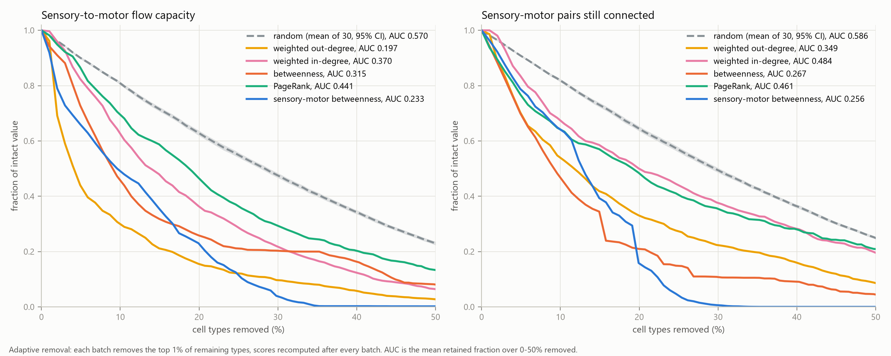

# Fragility scores

How much sensory-to-motor routing survives as cell types are removed, and how much faster it fails when the most central types are removed first. Each strategy is summarized by the area under its removal curve, one number for the whole first half of the attack. The protocol was fixed in `results/preregistration.md` before any removal was run. Every curve is in `results/percolation_curves.csv` and every score in `results/fragility_scores.json`.

## Graph

| quantity | value |
|---|---|
| cell types | 11,751 |
| connections | 243,439 |
| sensory types (S) | 368 |
| descending and motor types (M) | 665 |
| intact flow capacity (edge-disjoint S-to-M paths) | 10,647 |
| intact reachable S-M pairs | 237,405 of 244,720 (97.0%) |

## Protocol

- Strategies: random, weighted out-degree, weighted in-degree, betweenness, PageRank and sensory-motor betweenness.
- Adaptive removal: each batch removes the 1% of remaining cell types with the highest current score, and every score is recomputed on the reduced graph before the next batch. Reaching 50% removed takes 69 batches.
- Fragility score: the trapezoidal area under the retained fraction of the intact value, plotted against the fraction of cell types removed from 0% to 50%, divided by the width of that range. It is the mean retained fraction over the range: 1 means nothing was lost, and lower is more fragile.
- Metrics: flow capacity (primary) and the number of reachable sensory-motor pairs (secondary).
- Random removal: 30 trials, reported as the mean with a Student-t 95% confidence interval. Each targeted strategy is run once.
- Seed: 20260915.
- f_c: the fraction of cell types removed when flow capacity first falls below 50% of its intact value, interpolated between batches ([critical_thresholds.md](critical_thresholds.md)).

## Scores

| strategy | AUC, flow capacity | AUC, reachability | f_c |
|---|---|---|---|
| weighted out-degree | 0.197 | 0.349 | 0.041 |
| sensory-motor betweenness | 0.233 | 0.256 | 0.096 |
| betweenness | 0.315 | 0.267 | 0.090 |
| weighted in-degree | 0.370 | 0.484 | 0.139 |
| PageRank | 0.441 | 0.461 | 0.187 |
| random | 0.570 (95% CI 0.564 to 0.576) | 0.586 (95% CI 0.581 to 0.591) | 0.283 (95% CI 0.277 to 0.289) |

Across the 30 random trials, flow capacity AUC ranges from 0.539 to 0.605 (SD 0.016), reachability AUC from 0.554 to 0.615 (SD 0.014), and f_c from 0.255 to 0.313 (SD 0.016).

By flow capacity AUC the most damaging order is weighted out-degree (0.197), followed by sensory-motor betweenness (0.233), betweenness (0.315), weighted in-degree (0.370) and PageRank (0.441); random removal scores 0.570. By reachability AUC the order is sensory-motor betweenness (0.256), betweenness (0.267), weighted out-degree (0.349), PageRank (0.461) and weighted in-degree (0.484), against 0.586 for random removal. Ordered by f_c instead, the sequence is weighted out-degree, betweenness, sensory-motor betweenness, weighted in-degree and PageRank, because f_c marks the single point where flow halves while the AUC averages over the whole first 50% of removals.

Pre-registered check that every targeted strategy scores below the random mean on both metrics: met. Every targeted score also lies below the lower bound of the random-removal confidence interval.

## Null model

These scores describe one graph. Whether they are lower than the scores of degree-preserving randomized graphs, the pre-registered headline test, is reported in [null_model_validation.md](null_model_validation.md).

## Figure

Left: flow capacity. Right: reachable sensory-motor pairs. Both are shown as a fraction of the intact value over the first 50% of removals; random removal is the mean of 30 trials with its 95% confidence band.
